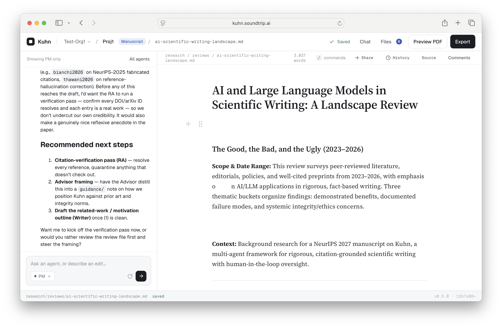

# Kuhn

An AI-assisted workspace for scientific research and writing: manuscripts, grant proposals,
protocols, SOPs and slide decks, drafted in a WYSIWYG markdown editor with a team of
specialized agents working alongside you.

Kuhn is built for the whole arc of a scientific project. A team of agents interviews you
about the work, builds the bibliography, drafts a skeleton, answers margin comments, reviews
the argument, and turns the draft into a submission-ready PDF, Word file, LaTeX source or
slide deck. When the project has data behind it, the same team runs the analysis: an Analyst
agent executes reviewed scripts in a sandbox, against files you upload or a private database
you connect, and hands tables and figures with provenance to the Writer. Use the writing
side on its own for a grant or a review article, or the full loop from raw data to a results
manuscript.



## What Kuhn does

- **A team of agents, not a chatbot.** Seven agents with distinct roles — Project Manager,
  Writer, Research Assistant, Advisor (domain expert), Reviewer, Analyst, and an in-app Help
  agent that answers questions about Kuhn itself. Chat streams token by token, agents ask
  you questions mid-task, the PM and Writer dispatch sub-agents, and a shared **project
  memory** carries facts, decisions and task outcomes between runs so no agent depends on
  the PM's context window. Each agent's chat is a durable server-side conversation that
  follows you across tabs and devices.
- **Project setup and seeding.** A setup wizard captures the document type, research
  question, deliverables and source materials, then a fixed pipeline runs parallel research
  (Research Assistant + Advisor) and writes a section skeleton with intent sentences and
  initial citations. Document types ship for manuscripts, grants, RWE and RCT protocols and
  SOPs; organizations can define their own, each with its own agent guidance and default
  page layout.
- **Grounded research and citations.** The Research Assistant searches PubMed, arXiv and
  the web and adds references through a registry-verified reference store (PubMed, Crossref,
  arXiv), which keeps `draft/references.bib` in sync and can re-verify every entry field by
  field. A `/cite` slash command inserts citations in the editor; the render resolves them
  with citeproc in PDF, Word and LaTeX.
- **A real editor.** Milkdown WYSIWYG markdown with Yjs real-time collaboration, anchored
  margin comments that agents can file, answer and resolve, agent edits presented as
  word-level suggestions you accept or reject hunk by hunk, and a source mode when you want
  the raw markdown.
- **Data analysis in the loop.** The Analyst runs R scripts in a network-isolated Docker
  sandbox: shared, versioned org scripts (promoted from projects through an owner review)
  or project scripts while iterating. Credentials from the **org secrets store** are
  injected into a run without ever reaching the model, and a run that carries a secret
  joins an internal Docker network, so the Analyst can query a private data warehouse
  under a least-privilege database role with no route to the internet. Tables land in
  `draft/tables/` and figures in `draft/figures/` with sibling provenance files, every run
  is logged, and the Writer and Reviewer are held to numbers that trace to those artifacts.
  See [Two end-to-end projects](#two-end-to-end-projects) below for a worked example.
- **Live preview and export.** The preview pane renders markdown → Typst → PDF; one click
  exports Word or LaTeX via Pandoc, all sandboxed. Page-layout templates (`nih-grant`,
  `manuscript`, or your organization's own Typst templates) give the preview the funder's
  margins and fonts so its page count is the one that matters, and the Word export carries
  the same layout through a reference `.docx`. After each render the editor draws
  **page-break lines** where the PDF's pages actually turn, and `page_limits:` in the front
  matter puts a live page-count badge on each capped section (`1.07 / 1 pages`, red when
  over). A `\newpage` line forces a page break in every output.
- **Slide decks.** A document with `marp: true` renders as Marp slides — PDF preview and an
  editable PowerPoint export — with Kuhn's built-in themes or CSS themes your organization
  uploads.
- **Organizations and administration.** Multi-tenant by design: organizations with
  viewer/editor/owner roles, invitation-only magic-link sign-in, project-scoped storage and
  a super-admin platform console. Owners manage token **budgets** per member and project,
  **model profiles and routing** (Anthropic, OpenAI, Google Gemini, OpenRouter, or any
  OpenAI-compatible endpoint, ranked per agent by task difficulty), a **knowledge library**
  built from a curated guidance catalog (reporting standards, regulatory guidance, style
  references) plus their own uploaded documents, the script library, secrets, slide themes,
  page-layout templates and document types.
- **Interchange with other writing tools.** Push a draft, its references and figures in as
  a bundle, collect anchored comments and edits in Kuhn, pull them back out; personal API
  tokens for scripts. See [docs/specs/interchange-bundle.md](docs/specs/interchange-bundle.md).

The in-app feature guide, [docs/features/](docs/features/), documents every panel, command
and front-matter key; the Help agent answers from it.

## Two end-to-end projects

[`test-projects/`](test-projects/) holds two complete projects you can recreate through the
UI — wizard answers, seed materials and an ordered set of chat prompts — that double as the
best tour of what Kuhn does. Both spend real model quota.

1. [**A manuscript about Kuhn itself**](test-projects/01-kuhn-manuscript/) — the core
   writing loop: wizard intake with seed-document uploads, the seeding pipeline, every agent
   in chat, `/cite`, a Reviewer pass, a slide deck, and PDF, Word and LaTeX output.
2. [**NSDUH psychedelics**](test-projects/02-nsduh-psychedelics/) — the data-analysis loop:
   a real Postgres database (the 2023 National Survey on Drug Use and Health public-use
   file, 56,705 respondents) on the internal sandbox network, a write-only database
   credential in the org secrets store, the Analyst querying it through `run_script` with
   survey-weighted statistics, generated tables and figures with provenance, and a results
   manuscript whose every number traces to an artifact. Its README is also the **admin's
   guide** to wiring a deployment to a private data warehouse with a least-privilege
   database role.

## Quick start

### Prerequisites

- Node.js 22.19+ — **use an LTS release** (e.g. 24). The provider-runtime spike's current Pi
  packages require 22.19, and Node 26 currently fails to build the native
  `better-sqlite3` dependency.
- Docker (for sandboxed rendering, export and Analyst script runs — the database is
  in-process SQLite).
- An `ANTHROPIC_API_KEY` (or Claude Code login credentials on a dev machine). Other
  providers are added per organization in Org admin → Models.

### Run it

From the repository root:

```bash
# Install everything (root orchestrator + both packages) — first time
npm install

# Configure backend credentials (first time)
cp agent-backend/.env.example agent-backend/.env   # then set ANTHROPIC_API_KEY

# Start backend (:3002) and webapp (:5174) together — Ctrl-C stops both
npm run dev
```

The root `package.json` is a dev-only orchestrator: its `postinstall` installs both packages,
so a single root `npm install` bootstraps the whole repository.

Open **http://localhost:5174**, create an organization and a project, and the setup wizard
opens; "Finish & launch" runs the seeding pipeline (research → skeleton draft). Agent runs
use real model quota. For a guided first session, follow one of the
[end-to-end projects](#two-end-to-end-projects).

The backend serves at **http://localhost:3002** (health check: `/health`). On startup it
creates the SQLite database, applies the schema, and seeds agents, tools, and assignments —
there is no database service to run. The database and uploaded project files live under
`KUHN_DATA_DIR` (default: repo-root `./data`) — `data/db/kuhn.sqlite` and
`data/files/<projectId>/`.

### Signing in

Authentication is controlled by `KUHN_AUTH_MODE` in `agent-backend/.env`:

- **`dev` (default)** — no login. Requests resolve to a seeded dev user and the sign-in
  screen never appears. Intended for local development and the token-free check scripts.
- **`magic-link`** — passwordless email login (requires `KUHN_SESSION_SECRET` at startup),
  and **invite-only**: a user enters their email on the sign-in screen, and an address that
  already belongs to an organization receives a single-use link (15-minute expiry). An
  address that does not is queued as an access request for a super-admin to review — no
  account is created and no link is sent. With no `KUHN_SMTP_URL` configured, links are
  printed to the backend console (`[auth] Magic link for …`) instead of emailed. See
  [docs/deployment.md](docs/deployment.md) for the full configuration.

### Running the packages individually

Each package is independently installable and runnable; the root commands wrap them.

```bash
# Backend — http://localhost:3002
cd agent-backend
cp .env.example .env      # first time; set ANTHROPIC_API_KEY
npm install               # first time
npm run dev

# Webapp — http://localhost:5174 (pinned; the backend CORS allowlist includes it)
cd webapp
npm install               # first time
npm run dev               # backend must be running
```

See [webapp/README.md](webapp/README.md) for webapp-specific notes.

## Deployment

Kuhn deploys as a single Node.js process: the backend serves the API, the collaboration
WebSockets, and the built webapp on one port, behind any TLS-terminating proxy or tunnel.

```bash
npm install
npm run build      # builds the webapp; production builds call the API on the same origin
npm start          # serves everything on :3002
```

See [docs/deployment.md](docs/deployment.md) for the full guide: required environment
variables, Cloudflare Tunnel configuration, inviting users, and running as a service.

## Development

### Additional prerequisites

Render, export, org-library PDF ingestion and Analyst script runs all execute inside Docker
images (no host Python, R, Typst or Pandoc required):

- `docker pull pandoc/core:latest minidocks/poppler:latest` — Word/LaTeX export and
  organization-library PDF ingestion
- `docker build -t kuhn/typst:latest docker/typst` — the PDF renderer with the fonts the
  page-layout templates need (the stock Typst image works, but page counts drift)
- `docker build -t kuhn/marp:latest docker/marp` — slide decks, with LibreOffice for
  editable `.pptx` export
- `docker build -t kuhn/r-analysis:latest docker/r-analysis` — the Analyst's R runtime; the
  sandbox has no network, so packages are baked in (see `docker/r-analysis/README.md`)
- `docker network create --internal kuhn-data` — only if Analyst runs need to reach a
  database (see test project 2)
- Claude Code CLI (`npm install -g @anthropic-ai/claude-code`)

Re-seed agents, tools and catalogs after editing prompts or seed data with
`npm run db:seed` (from `agent-backend/`). [TESTING.md](TESTING.md) describes the test
suites and the token-free check scripts.

See [CLAUDE.md](CLAUDE.md) for contributor guidance (repository layout, where things live,
agent prompts, conventions).

### Architecture

```
┌──────────────────────────────────────────────────┐
│                Browser (single app)               │
│  ┌───────────┐  ┌────────────────┐  ┌─────────┐  │
│  │ Agent     │  │ Milkdown       │  │ File    │  │
│  │ Chat      │  │ Editor (md)    │  │ Manager │  │
│  └─────┬─────┘  └───────┬────────┘  └────┬────┘  │
└────────┼────────────────┼────────────────┼───────┘
         │        WebSocket / REST         │
┌────────▼────────────────▼────────────────▼───────┐
│              Agent Backend (Node.js)              │
│  ┌─────────────┐ ┌──────────┐ ┌───────────────┐  │
│  │ Agent       │ │ Storage  │ │ Render/Export │  │
│  │ Runtime     │ │ API      │ │ (Typst,       │  │
│  │ (Claude     │ │ (project │ │  Pandoc,      │  │
│  │  Agent SDK) │ │  scoped) │ │  sandboxed)   │  │
│  └─────────────┘ └──────────┘ └───────────────┘  │
│           SQLite (file) · Yjs servers             │
└───────────────────────────────────────────────────┘
```

See [docs/architecture.md](docs/architecture.md) for details and
[ADR 001](docs/adr/001-provider-agnostic-runtime-foundation.md) for the provider-runtime
migration decision. The Claude runtime remains the current production path while the Pi-core
adapter proves contract and quality parity.

Integrating another writing tool? [docs/specs/interchange-bundle.md](docs/specs/interchange-bundle.md)
is the bundle format and API contract (bearer tokens, `POST …/import`, `GET …/export`);
`test-projects/interchange/` is a ready-made bundle and `webapp/scripts/interchange-check.mjs`
walks the whole round trip against a running backend.

Evaluating Kuhn for your organization? [docs/data-pipeline.md](docs/data-pipeline.md) lays
out where all data is stored and processed, what is ephemeral, what leaves the machine
(LLM provider, PubMed/arXiv, SMTP), and a production checklist.

### Agents

The seven agents' system prompts (including the in-app `help` agent, which answers questions about Kuhn from `docs/features/`) live in
[`agent-backend/src/db/prompts/`](agent-backend/src/db/prompts/) and their models/tools in
`agent-backend/src/db/seed-data.js`; both are seeded into the database at startup, and the
runtime loads prompts from there.

### Project management

Public work is tracked through [GitHub issues](https://github.com/soundtrip-health/kuhn/issues)
and pull requests. The maintainers' epic/story planning record lives in a private companion
repository. See [CONTRIBUTING.md](CONTRIBUTING.md) for how to report bugs, propose features,
and submit changes.

## License

[MIT](LICENSE).
