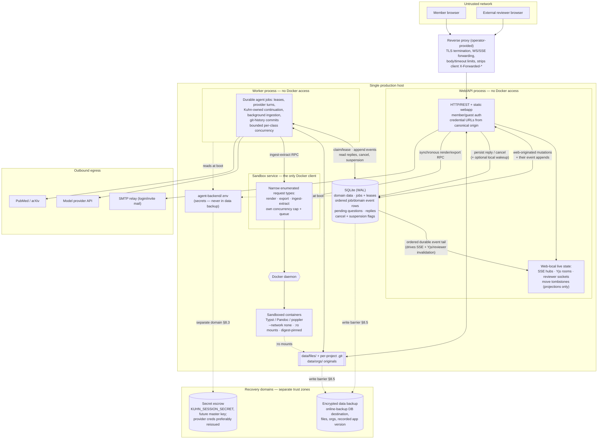

# ADR 002: Production deployment topology and scale boundary

- **Status:** Accepted for the first-team pilot
- **Date:** 2026-08-16
- **Issues:** PLA-225 (this ADR); informs PLA-236, PLA-240, PLA-241, PLA-242,
  PLA-244, PLA-245, PLA-246, PLA-248
- **Companion:** [threat-model.md](../security/threat-model.md) (PLA-224) — the
  security model and this topology constrain each other and were written as one pass.
- **Relationship to ADR 001:** ADR 001 (provider-neutral runtime) is **pending in
  [PR #69](https://github.com/soundtrip-health/kuhn/pull/69)**, not yet on `main`; it
  lands at `docs/adr/001-provider-agnostic-runtime-foundation.md` when #69 merges. This
  ADR references its accepted direction (a narrow `AgentRuntime` seam beneath
  `runAgentTask`) but does not depend on its implementation details.

## Context

Today Kuhn is **one Node process** serving REST, the static webapp, SSE, and Yjs
collaboration WebSockets, with **in-process SQLite** (WAL), **local project/org files**,
**in-memory** live-run and pub/sub registries, and **direct Docker execution** for
rendering/ingestion (`index.js:94-129`, `db.js:14-21`, `sandbox.js:56`). That is simple
and genuinely useful, and much of it is well-disciplined — a single storage chokepoint
with symlink-proof containment (`storage.js:80-114`), per-project git history, a
credential-free sandbox environment, and a tenancy chokepoint the super-admin flag never
bypasses (`db/orgs.js:33-59`).

But the production boundary must be explicit before the reliability issues in milestones
3–4 each make a local topology choice. Two properties of the current process are
load-bearing and set the terms of every decision below:

1. **Everything is one trust zone.** The request handler, the agent runtime, the SQLite
   file, the project files, and the **host-root-equivalent Docker socket** all live in
   one OS process on one host. (Threat model §1, T-25.)
2. **The database is synchronous and single-writer.** better-sqlite3 blocks the event
   loop on every query (`db.js:63-65`); there is no `busy_timeout` (`db.js:14-21`), so a
   second writer throws `SQLITE_BUSY` rather than waiting. This is the concrete ceiling
   the scale triggers key off.

### First production target

**Not hyperscale SaaS.** The first real deployment is a **small scientific/technical
writing team** (single organization, or a handful) using Kuhn for valuable, sensitive
work: unpublished manuscripts, grant material, protocols, org knowledge, uploaded
sources, reviews, agent transcripts, citations, and model/provider credentials. The
goal is **the smallest architecture we can reasonably call production-safe** — not the
most enterprise-looking one. We do **not** introduce distributed infrastructure for
aesthetics; we also **do not** keep a prototype shortcut that creates a real
confidentiality, integrity, durability, recovery, or host-compromise risk.

Every decision below states: **(1)** the pilot choice, **(2)** why, **(3)** alternatives
considered, **(4)** the operational/security tradeoff, **(5)** the scale ceiling or
trigger that forces a revisit.

## Decision summary

| Area | Pilot decision | Hard trigger to revisit |
|---|---|---|
| Web/API | **Single instance**, single port, behind a reverse proxy | Need for a second web replica for availability, or CPU-bound request serving |
| Background jobs | **Split into a dedicated worker process** on the same host, sharing the DB and files, with DB-backed leases **and a DB-backed durable event/control seam** (§2.3) | Worker CPU saturation; need for multiple workers |
| Database | **Keep SQLite** (WAL, single writer), accessed by web + worker on one host | Sustained write contention / `SQLITE_BUSY`; need for a second host to touch data → **Postgres** |
| File storage | **Local durable disk**, backed up with the DB | Multi-host access to files; capacity beyond one volume → network/object storage |
| Collaboration (Yjs) | **Single-instance in-memory rooms**, durability via autosave | Any second web instance that terminates WebSockets |
| Sandbox | **Dedicated local sandbox service** with a narrow enumerated request surface; the *only* Docker client; web/worker call it over local RPC; **interactive render/export stays synchronous** (§6) | — (this is itself the hardening; larger isolation only if multi-host) |
| Reverse proxy / TLS | **Required**; credential URLs minted from the **canonical configured origin**, never request Host; bounded `trust proxy` for request metadata only | Multi-instance → real load balancer |
| Backup/restore | **Two recovery domains**: encrypted data backup (SQLite online-backup destination + files + orgs, under a brief write barrier) and a **separate secret escrow**; app version recorded (§8) | Backup window exceeds tolerance → incremental/streaming |
| Deployment artifact | **Immutable container image** for the server components (incl. `guidance-docs/`) + digest-pinned sandbox images | — |
| Observability | Structured logs + **component-specific** readiness: web stays ready when worker/sandbox/provider degrade; affected endpoints 503 (§10) | — |

The through-line: **keep request-serving simple and single-instance; separate the two
things that are genuinely unsafe or unreliable co-resident — durable background
execution (PLA-244) and host-privileged Docker control (PLA-240); make persistence
recoverable (PLA-241/242); and build the *seam* for multi-instance later rather than
paying its cost now.**

## Pilot topology (target state)

The diagram below is the **target production-pilot topology** this ADR decides —
three processes on one host, coordinating through SQLite as the durable seam. (The
*current-implementation* trust-boundary diagram — one process, direct Docker — is in
the [threat model §1.1](../security/threat-model.md); the two are deliberately
different pictures.)

What the picture pins down: the **web↔worker seam is SQLite** — ordered durable
event rows flowing worker→web, persisted control state flowing web→worker (§2.3);
the web process alone owns live connections (SSE, Yjs, reviewer sockets); the worker
alone talks to the model provider and research APIs; the sandbox service alone talks
to Docker; and the backup and secret-escrow destinations are separate trust
domains.

---

## 1. Web/API topology

**Decision:** one web/API instance for the pilot, single port (default 3002), behind a
TLS-terminating reverse proxy. Unchanged from today except that background execution and
sandbox invocation move out (below).

**Why:** a small team's request load is trivial; the app already serves REST + static +
SSE + WS from one port (`index.js:94-129`), which eliminates CORS and cookie-scope
configuration (`deployment.md:168-181`). A second instance would immediately break two
things that are in-memory and single-owner today — Yjs rooms and the SSE/live-run
registries — for **zero pilot benefit**.

**Alternatives considered:** (a) multi-instance web behind a load balancer — rejected:
no pilot need, and it forces Yjs coordination (§5) and sticky sessions we don't want to
pay for yet. (b) Serverless/function split — rejected: incompatible with long-lived
SSE/WS and in-process agent runs.

**Operating envelope (supported):** one organization or a few; low tens of concurrent
users; a handful of concurrent agent runs; Yjs editing within a small team per
document. The **SSE subscriber cap is 20 per project/org** (`config.js:125`) — a real
ceiling to raise deliberately, not a load limit to discover.

**What cannot safely remain inside the web process:**

- **Durable background/agent execution** — today live runs are in-memory objects on the
  request event loop (`runs.js:22-42`); a restart marks them `interrupted`
  (`jobs.js:135-141`) and loses in-flight work. → dedicated worker, §2.
- **Docker control** — direct `docker` CLI invocation makes the web process host-root
  equivalent (`sandbox.js:56`). → sandbox worker, §6.

**Scale trigger:** move to multiple web replicas only when a single instance is
CPU-bound on request serving *or* availability requires no-single-point-of-failure. That
step **requires** externalizing Yjs coordination (§5) and the SSE/run registries, and
almost certainly Postgres (§3) — it is a topology change, not a config flag, and this
ADR deliberately defers it.

---

## 2. Background jobs — the worker and the web↔worker seam

**Decision:** move durable agent/background execution into a **dedicated worker
process** on the **same host**, sharing the same SQLite database and the same file
volume, coordinating through **DB-backed job leases and a DB-backed, append-only
durable event/control seam** (§2.3). SQLite *is* the channel; no broker, no Redis. Not
a separate service tier — a second Node process supervised alongside the web process.

**Why:** durable execution is the one part of the runtime that is unsafe co-resident with
request serving. Today a deploy/restart or a crash loses in-flight runs, parked
`ask_user` runs live forever with unbounded event buffers (`config.js:87-90`,
`runtime.js:179-184`), and org suspension doesn't stop a running job
(`runtime.js:1029-1033`). A worker with an explicit lifecycle fixes all three without a
broker.

### 2.1 Process ownership

| Process | Owns |
|---|---|
| **Web/API** | HTTP/API; member/guest auth; SSE connections; Yjs/WebSocket rooms and the signaling endpoint; reviewer socket registries; move tombstones and every other client-facing **live projection**; web-originated durable mutations (editor uploads/moves/deletes, org-library writes, admin/review state) |
| **Worker** | Durable agent-job execution; provider/model calls; research-API calls; job leases and lifecycle; resumable Kuhn-owned continuation (ADR 001); background ingestion; git-history commit execution (§2.4); appending job/domain events for its own work |
| **Sandbox service** | Docker/container invocation **only** — a narrow, enumerated set of render/ingest request types (§6); never an arbitrary command interface |

### 2.2 Why "just move `runAgentTask`" is not enough

Current job/event semantics are **process-local**, and naively relocating the runtime
would break product behavior. A top-level `runAgentTask()` constructs an `EventChannel`
whose `onEvent` calls `publishProjectEvent()` (`project-events.js:64`), and that hub
owns real product invariants, not just UI fan-out: file-activity persistence
(`recordFileEvent`), path-keyed DB rewrites on moves (`applyMove`, transactional with
the activity row), review-link revocation on delete, closing the revoked links' live
reviewer connections, Yjs room eviction, move tombstones and clearing them on new
writes, reviewer-only-room refresh, git-history scheduling and terminal-job commits,
and finally SSE fan-out to in-memory subscribers. Separately, `runs.js` holds live run
handles and `questions.js` holds pending `ask_user` waiters in in-memory `Map`s, and
`/reply`, `/pending`, and `/reconnect` execute against those maps in the web process
(`routes/agent.js:122-167`). Move the runtime to a second process without replacing
these seams and the worker's copy of the hub has no subscribers, no rooms, and no
reviewer sockets — while the web process can no longer deliver replies or reconnects
to the run. The contract below is what PLA-244/243 build to.

### 2.3 The durable event/control seam (the pilot contract)

DB-backed in both directions. **Correctness never depends on an ephemeral channel;
restart correctness comes from persisted state.**

- **Worker → web: ordered durable events.** The worker appends job/domain events —
  job lifecycle transitions, agent output, `file_change`, question-asked, org
  `doc_status`, terminal state — as **append-only rows with a per-job monotonic
  sequence** (project/org events additionally ordered per scope). The web process
  tails these rows and serves its SSE/client projections and room invalidations from
  them. A local wakeup (Unix domain socket or similar) MAY be used to shorten tail
  latency, but it is an optimization only: a dropped wakeup or a dead socket loses
  nothing, because the next tail read sees the rows.
- **Web → worker: persisted control state.** `ask_user` replies, cancellation, and
  project/org suspension are **persisted control rows/flags** the worker reads at
  defined points — before each provider turn, on lease renewal/heartbeat, and when
  unparking a question. `POST /jobs/:id/reply` becomes "persist the reply, then wake
  the worker"; `GET /pending` and `POST /jobs/:id/reconnect` read durable
  question/job state instead of the in-memory maps. The pending-question row (question
  text, asking agent, asked-at) is itself durable state, published as an event and
  queryable.
- **Delivery is at-least-once; every replayable consumer effect is idempotent.** The
  web tracks the last event sequence it projected; SSE clients carry a cursor
  (`Last-Event-ID`-style) so a browser reload replays from where it left off. Nothing
  correctness-bearing lives only in web-process memory.
- **Restart matrix:**
  - *Browser reload:* the client resubscribes with its cursor; the pending question is
    re-emitted from the durable question row.
  - *Web-process restart:* live connections drop; on restart the web re-tails the event
    rows and rebuilds projections; clients reconnect with cursors. No event is lost.
  - *Worker restart / reclaim:* the lease expires; the job is reclaimed and resumes
    from Kuhn-owned continuation (ADR 001). The continuation checkpoint records the
    last appended event sequence, so a resumed job continues the sequence instead of
    double-appending. A parked question survives as durable state across the restart.
  - *Terminal state:* the terminal job event row is the durable truth; the live-run
    registry (`runs.js`) becomes a derived cache over jobs + events, not the authority.

### 2.4 Exactly one authoritative side-effect path

`publishProjectEvent()` today conflates two kinds of effect. The corrected split:

1. **Authoritative durable mutations** — `recordFileEvent`, `applyMove`'s path-keyed
   rewrites, review-link revocation (the DB half), git-history commits — are performed
   **exactly once, in the process that originates the mutation**, coupled atomically
   (same SQLite transaction wherever possible) with appending the corresponding domain
   event row. Worker-originated file changes: the worker. Web-originated editor/REST
   mutations: the web process, as today. **Neither process ever re-executes the
   other's durable mutations when consuming an event row** — the row is the *record*
   that the mutation already happened, never an instruction to redo it. This is what
   rules out double-application (a move applied twice, a link revoked twice against a
   recreated path, a file event recorded twice).
2. **Web-local live projections** — Yjs room eviction, move tombstones and their
   clearing, closing reviewer sockets after a revocation, reviewer-only-room refresh,
   SSE fan-out — happen **only in the web process**, which owns those live
   connections: inline for web-originated events, via the durable tail for
   worker-originated ones. All are idempotent against live connection state (evicting
   an absent room, closing an already-closed socket, re-planting a tombstone are
   no-ops), which is what makes at-least-once delivery safe.

**Git history is the one effect that changes owner.** Two processes running git against
the same workspace would race the per-project commit serialization that is in-process
today (`history.js:97-103`). Commit *execution* therefore moves to the worker as a
lightweight job class: web-originated changes mark the project commit-pending
(durable), the worker coalesces and commits on the existing debounce semantics, and
terminal-job commits are emitted by the worker inline with the run. A worker outage
degrades history *granularity* (pending commits flush when it returns) without losing
any file content.

**The crash window, named.** A mutation crosses up to four steps: **filesystem
mutation → SQLite mutation + event append (one transaction) → wakeup/tail → web-local
projection.** Each gap is bounded: fs-then-DB is the same window that exists today,
and `applyMove`'s throw-to-producer compensation contract (the producer renames back
on a failed rewrite) is preserved; DB-commit-then-notification is safe because the
event row is durable and the next tail read delivers it; notification-then-projection
is safe because projections are idempotent. What the contract forbids: performing a
durable mutation in one process and its event append in another, or letting both
processes apply the same durable mutation. PLA-244 implements the seam; PLA-243's
audit/idempotency work verifies these invariants.

### 2.5 Leases, cancellation, suspension

- **Claim/lease:** a job row is claimed by `UPDATE … SET worker_id, lease_expires_at
  WHERE status='pending' AND lease IS NULL`-style atomic guard (the codebase already
  uses exactly this atomic-guarded-UPDATE idiom for auth tokens, invitations, and review
  links — `db/auth.js:62-70`, `db/invitations.js:105-111`). Leases are renewed on a
  heartbeat and expire so a dead worker's jobs are reclaimable.
- **Process restarts:** the existing boot-time `markOrphanedJobsInterrupted()`
  (`jobs.js:135-141`) becomes lease-aware — only jobs whose lease has expired are
  reclaimed, and it must be scoped so it is safe when web and worker start independently
  (today it is a blanket `UPDATE` unscoped by host — dangerous the moment two processes
  share the DB).
- **Cancellation:** persisted control state (§2.3), observed at turn boundaries and on
  lease renewal — not an ephemeral signal.
- **Resume/recovery:** continuation is Kuhn-owned and serializable per ADR 001 (#69), so
  a reclaimed job resumes from persisted state, not an opaque provider session.
- **Org/project suspension:** the same control channel; the worker checks at turn
  boundaries and on lease renewal, terminating in-flight runs — closing T-28. (Today
  only *new* dispatch and `search_org_knowledge` refuse.)
- **Operational isolation:** worker crashes don't take down request serving, and vice
  versa; each is supervised independently.

### 2.6 Worker execution model and concurrency

"One worker process" is a supervision statement, **not** a serialization claim — a
Node process runs many asynchronous jobs concurrently. The pilot execution model:

- **One worker process** with **bounded, configurable concurrency**, enforced as
  explicit slot pools per job class — agent runs and ingestion at minimum — not as an
  accident of the event loop. This ADR deliberately sets no fixed numbers (there is no
  evidence to support any); it fixes the *mechanism* (config-driven caps, measured
  under PLA-245 telemetry) and PLA-244 sets defaults from observed load.
- **A parked `ask_user` job does not consume an execution slot.** It retains its lease
  and durable state (question row, continuation) but releases its provider-turn slot;
  otherwise one question the user stepped away from starves every other job — the
  failure mode strict concurrency=1 creates. Active provider turns count against the
  agent-concurrency pool; parked jobs are reaped by the parked-run TTL (T-28).
- **Ingestion is bounded independently** with its own pool, replacing today's
  unbounded `setImmediate` fan-out (`ingest.js:186-188`).
- **The sandbox service enforces its own container concurrency cap and queue** (§6) —
  worker slots and container slots are separate budgets, so a render burst cannot
  starve agent turns or vice versa.
- **What runs where:** provider calls and background ingestion move to the worker —
  spend/concurrency controls (PLA-238) get one home, and a 200-page PDF ingest never
  competes with request latency on the web event loop. **Interactive render/export
  does not move** — it stays a synchronous web→sandbox-service call (§6).

**Alternatives considered:** (a) keep jobs in the web process — rejected: the durability
and suspension gaps are real production risks, and heavy agent/ingest work on the request
event loop is a latency problem. (b) External queue/broker (Redis/BullMQ, SQS) —
rejected for the pilot: durable ordered events and control flags on the SQLite we
already run are sufficient at this concurrency, and adding Redis is exactly the
"distributed infrastructure for aesthetics" this ADR refuses. The seam keeps the
*option* open — moving events to a broker later is a change inside the seam, not a
product rewrite. (c) Ephemeral IPC (socket/pipe) as the primary channel — rejected:
restart correctness would then depend on both processes being up and connected;
demoted to an optional wakeup optimization (§2.3).

**Tradeoff:** two processes now share one SQLite file. SQLite handles multi-process
access under WAL, but **without `busy_timeout` a writer collision throws immediately**
(`db.js:14-21`); PLA-241/244 must set a `busy_timeout` and keep write transactions short.
This is the first place the single-writer property bites, and it is the leading edge of
the Postgres trigger (§3).

**Scale trigger:** multiple workers, or a worker on a *different host* from the DB, forces
Postgres (§3) — SQLite is single-host by construction.

---

## 3. Database

**Decision:** **keep SQLite** for the pilot. WAL mode, foreign keys on, accessed by the
web and worker processes on **one host**. Do **not** move to Postgres before first-team
deployment.

**Why — evaluated against the actual workload, not aesthetics:**

- **One deployment, low concurrency.** A small team generates few writes per second.
- **Yjs traffic never touches the DB.** Live collaboration is in-memory
  (`yjs-websocket.js:8-10`); durability is the editor's debounced autosave writing files
  (`routes/files.js:106-137`), not DB writes. The high-frequency collaboration path
  therefore does not load the database at all — a key reason SQLite is sufficient.
- **The heavy writes are transcripts, event rows, and chunks**, which are append-mostly
  and bounded by the worker's explicit per-class concurrency caps (§2.6). SQLite is
  appropriate because write concurrency is **bounded and measured** — few writers,
  short transactions, `busy_timeout` set — *not* because "one worker process"
  serializes writes (it doesn't; a Node worker runs jobs concurrently).
- **Migration safety and operational simplicity.** One file, no DB service to run,
  secure, back up, patch, or tune. For a small team this is a feature, not a compromise.
- **Postgres is not automatically "more production."** It would add a service to operate,
  a network trust boundary, connection pooling, and its own backup discipline — real
  cost with no pilot benefit at this concurrency.

**If SQLite stays (it does), this ADR fixes the supported envelope:**

- **Access topology:** at most the web process and one worker, **on the same host**,
  against one DB file. No third writer, no networked filesystem for the DB, no second
  host. Set **`busy_timeout`** (PLA-241) so brief contention waits instead of throwing.
- **Backup method:** the SQLite **Online Backup API** — better-sqlite3 `db.backup()`
  (or `VACUUM INTO`) — producing a consistent standalone destination database; never a
  naive `cp` of the live `kuhn.sqlite` alone. The WAL carries uncheckpointed data
  (observed locally: 2.7 MB WAL vs 4 KB main DB); a main-file-only copy backs up
  essentially nothing (T-34). See §8.1.
- **Filesystem requirements:** a POSIX filesystem with correct `fsync`/locking — **local
  disk**, not NFS/SMB (SQLite locking over network filesystems is unreliable).
- **Schema evolution:** replace the startup-time ad-hoc DDL — a hand-maintained
  `COLUMN_MIGRATIONS` list plus `DROP TABLE`-based rebuilds that run on live data with no
  version table (`db/init.js:14-42,82-183`) — with a **versioned migration ledger** and a
  **pre-migration backup gate** (PLA-241). Today `initDb` failure *starts the server
  anyway* (`index.js:116-119`); production must fail closed (PLA-236).

**When Postgres becomes mandatory (any one):**

- a **second worker**, or any process that must touch the data from a **different host**;
- sustained **write contention** — recurring `SQLITE_BUSY`/lease churn under normal load;
- **multiple web replicas** (which SQLite cannot back across hosts);
- the org-library corpus or transcript volume outgrowing single-file practicality, or
  backup windows (§8) becoming unacceptable.

Because everything is project/tenant-scoped with an owner/tenant column from day one
(`architecture.md:156-163`), the Postgres path is `tenant_id` + row-level security, not a
rewrite — but it is a genuine migration, gated by the triggers above.

---

## 4. File storage

**Decision:** project and org-library files stay on **local durable storage**, backed up
**together with** the database. No network or object storage for the pilot.

**Why:** files are accessed only by the co-located web and worker processes through the
`storage.js` chokepoint; there is no multi-host reader to justify shared storage. Local
disk is the simplest durable option and keeps the strong containment invariants intact.

**Definitions this pins down:**

- **Directory ownership:** `KUHN_DATA_DIR` owns everything — `db/`, `files/<projectId>/`
  (each with its own `.git`), `orgs/<orgId>/library/`, and transient `files/.render-tmp/`
  (`config.js:6-7,22,69,111`, `data-pipeline.md:38-43`). Owned by the service user; the
  worker needs the same read/write access as the web process.
- **Backup relationship to SQLite:** files and DB must be captured as **one consistent
  snapshot** (§8). Org-library originals are **not reconstructible from the DB** (only
  sha256 + chunks persist — `schema.sql:290-315`), so excluding `orgs/` silently loses
  source documents. Per-project `.git` lives *inside* the workspace — a "user content
  only" filter that skips dotdirs silently drops all version history.
- **Atomicity expectations:** writes go through `storage.js` (contained, symlink-proof);
  history commits are serialized per project (`history.js:97-103`). There is no
  cross-file transactionality between the DB and the filesystem — the backup consistency
  model (§8) is how we bound the resulting skew.
- **Network/object storage:** **not required now** and not adopted. It would solve
  multi-host access and elastic capacity — neither a pilot need — at the cost of a new
  egress boundary, a new credential, and losing local `.git`/`realpath` containment
  semantics.

**Scale trigger:** multiple web/worker hosts needing shared file access, or capacity
beyond a single volume, triggers network/object storage — the same multi-host threshold
as the Postgres trigger, and the two will likely move together.

---

## 5. Collaboration / Yjs

**Decision:** Yjs room state stays **single-instance and in-memory**; durability comes
from autosave to storage. No external Yjs coordination (no Redis, no y-sweet/hocuspocus
cluster) for the pilot.

**Why:** rooms are `Map`-held per process (`yjs-websocket.js:86`), seeded from storage on
first open and reseeded after restart (`editor-core.ts:417-468`); a crash loses only
not-yet-autosaved keystrokes (`data-pipeline.md:112-118`). With a single web instance
this is correct and cheap. External coordination exists only to share room state *across
instances* — which the pilot does not have.

**Pilot expectations, made explicit:**

- **Single-instance ownership:** exactly one web process terminates all doc-sync
  WebSockets; room identity is process-local.
- **Restart behavior:** all rooms vanish on restart; the next opener re-seeds from
  storage bytes. Un-autosaved keystrokes since the last debounced save are lost — the
  accepted durability boundary.
- **Persistence/reseed:** no Yjs persistence layer; storage is the source of truth. The
  server designates one write-capable connection per empty room as seeder
  (`yjs-websocket.js:696-711`).
- **Why no external coordination:** it buys cross-instance room sharing, which requires
  multi-instance web — explicitly out of pilot scope (§1).
- **Graceful shutdown gap:** there is no SIGTERM handler today, so a deploy drops rooms
  and abandons up-to-120 s of coalesced git commits (`unref`'d timers, `history.js:142`).
  PLA-246 must add draining + a commit flush on shutdown.

**Trigger for Redis/shared coordination:** the first time a second web instance
terminates WebSockets. At that point rooms must move to a shared coordinator (Redis
pub/sub or a dedicated Yjs backend) *and* the SSE/live-run registries must externalize
too. This is the same multi-instance threshold as §1/§3 — deferred as one step.

---

## 6. Sandbox boundary

**This is the most important security decision in the ADR.** Today the public Node
web/API process invokes Docker directly (`spawn('docker', …)`, `sandbox.js:56`).
**Docker control is effectively host-root**: a compromise of the web process (e.g. via a
dependency RCE) collapses the sandbox boundary and yields host takeover (threat model
T-25, the one Critical topology finding).

**Decision:** the web process **loses direct Docker access**. Sandbox execution moves
behind a **dedicated local sandbox worker/service** with a **deliberately narrow
invocation surface** — the simplest robust isolation that removes host-root-equivalent
control from the internet-facing process. **No orchestration system** (no Kubernetes, no
Nomad). This is the boundary PLA-240 implements.

**The narrow surface:** the sandbox service accepts only a small, enumerated set of
render/ingest job kinds with typed parameters — never an arbitrary `docker run` command
line. The web/worker processes call it over a **local-only** channel (Unix domain socket
or loopback), and it is the *only* component with Docker access. The existing argument
validation is already shaped for this: Pandoc extra-args are allowlisted by regex and
documented as never-user-input (`sandbox.js:158-166`); the render service composes fixed
arguments (`render.js:45-49`). PLA-240 formalizes that into the service's request schema.

**Interactive render/export stays synchronous.** `POST /api/projects/:id/render` and
`GET /api/projects/:id/export` return PDF/export bytes in the response today
(`routes/render.js:52,68`), and this ADR deliberately preserves that product
semantic — they are **not** converted into background jobs. The web process makes a
**bounded synchronous request/reply call to the sandbox service** over the narrow
local RPC and streams the result back to the caller; the web process itself still has
no Docker access, and the service's concurrency cap/queue and resource limits protect
the host from render bursts (T-22). If the sandbox service is down or saturated, the
render/export endpoints return a clear **503/degraded** response — the editor and the
rest of the app stay available (§10). Routing interactive render through the job
worker was considered and rejected: it would add a request/reply RPC hop through the
worker for no isolation gain (the worker has no Docker access either), and couple
editor-facing latency to the job queue. **Background ingestion** extraction, by
contrast, is naturally asynchronous and is invoked by the worker through the same
sandbox service.

**Specification for PLA-240:**

- **Trust boundary:** only the sandbox service talks to the Docker daemon; the
  web/API process does not have Docker socket access. A web-process RCE can *request* a
  render, not run arbitrary containers.
- **Filesystem mounts:** project mounted **read-only** at `/work`; a single writable
  scratch out-dir at `/out`; nothing else (as today, `sandbox.js:30-31`). Ingestion
  already narrows the mount to one document's directory (`ingest.js:41-43`) — keep that.
- **Network policy:** `--network none` (unchanged, `sandbox.js:26`).
- **Image pinning:** pin the three images by **digest**, not `:latest`
  (`config.js:152-155` today) — supply-chain integrity for code that parses untrusted
  documents (T-26).
- **Resource limits:** keep cpu/memory/pids caps and the 60 s kill; **add** `--ulimit
  fsize` so a renderer cannot fill the host disk through `/out`, and enforce a
  **concurrency cap / queue** on sandbox jobs (today ingestion fans out via bare
  `setImmediate` with no limit — `ingest.js:186-188`; render is viewer-triggerable —
  `routes/render.js:52`; T-22).
- **Privilege expectations:** add `--user` (non-root in-container), `--read-only` root
  fs with a `--tmpfs /tmp`, `--cap-drop=ALL`, and `--security-opt=no-new-privileges` —
  all absent today (T-24).
- **Credentials/data visibility:** the sandbox environment carries **no credentials**
  today (verified: no `-e`/`--env-file` in `buildDockerArgs`) — preserve this exactly.
  Sandbox jobs see only the mounted project bytes and their parameters; never `.env`,
  never the DB, never another tenant's files.

**Alternatives considered:** (a) keep direct Docker with only flag hardening — rejected:
flag hardening (T-24) is necessary but does not remove host-root-equivalent control from
the internet-facing process (T-25). (b) A full orchestrator or per-tenant VM isolation —
rejected for the pilot: disproportionate operational weight; a local sandbox service with
a narrow surface achieves the essential property (web-process compromise ≠ host root).
(c) gVisor/Kata/rootless-Docker as the runtime under the service — **compatible** with
this decision and worth evaluating inside PLA-240, but orthogonal to moving the boundary.

---

## 7. Reverse proxy and TLS

**Decision:** a reverse proxy in front is **required** in production; the app has no TLS
of its own. Vendor-neutral (Cloudflare Tunnel and nginx both work — `deployment.md:97-116`).

Requirements:

- **TLS termination** at the proxy; HTTPS only. The session/reviewer cookie `secure`
  flag is derived from `KUHN_APP_URL` (`routes/auth.js:29-31`), so **`KUHN_APP_URL` must
  be the real https origin** or cookies ship non-Secure (T-02) — PLA-236 validates this
  at boot.
- **Canonical public origin for credential URLs:** today magic-link/invite/review URLs
  are built from `req.protocol` + `req.get('host')` (`routes/auth.js:48`,
  `routes/orgs.js:109`, `routes/review-links.js:80`) with `app.set('trust proxy',
  true)` trusting *all* hops (`index.js:38`) — a **host-header injection →
  credential-exfiltration** path if the origin is directly reachable or the proxy
  forwards client `X-Forwarded-*` (T-27). The production fix is not primarily proxy
  discipline: **credential-bearing URLs are generated from the validated, configured
  canonical public origin — `KUHN_APP_URL` — never from request protocol/Host.** That
  removes Host-header choice from the credential-minting path entirely, instead of
  making proxy correctness the security root. (PLA-236 validates `KUHN_APP_URL` as a
  real https origin at boot; no separate canonical-origin setting is needed unless a
  deployment ever serves the app on an origin other than `KUHN_APP_URL`.)
- **Proxy identity & trusted headers (defense-in-depth):** still **bound `trust proxy`
  to the known proxy** (hop count or subnet) for request metadata that genuinely needs
  proxy awareness (client IP for rate limiting/audit, scheme for redirects and logs);
  ensure the proxy **sets** `X-Forwarded-Proto`/`Host` and **strips** client-supplied
  forwarding headers; and **block direct origin reachability**. (PLA-236.)
- **WebSocket & SSE support:** the proxy must forward WS upgrades (Yjs) and not buffer SSE
  (`X-Accel-Buffering: no` is already set — `routes/sse.js`); the job-scoped agent stream
  has **no heartbeat**, so proxy idle timeouts must accommodate long turns or PLA-245/246
  must add one.
- **Upload/body limits:** JSON body is 100 KB (`express.json()`, `index.js:42`); raw file
  bodies and uploads are capped at 20 MB × 20 (`config.js:107`, `routes/uploads.js:14-18`).
  The proxy should enforce a matching max body size so oversize requests die at the edge.
- **Timeouts:** proxy read/write timeouts must exceed legitimate long-lived streams
  (agent runs, large renders) but bound truly stuck connections.
- **Production `trust proxy` policy:** as above — a specific, bounded setting, never
  blanket-trust, and never with the origin exposed.

**Not hard-coded to one vendor.** Cloudflare Tunnel is the documented example
(`deployment.md:97-116`); any proxy meeting the above is acceptable.

---

## 8. Backup and restore ownership

**Decision:** recovery is split into **two coordinated domains** — an encrypted **data
backup** and a separately protected **secret escrow** — plus the **versioned
application artifact** (§9). "One recoverable Kuhn deployment" = data backup + the
matching application artifact + secrets re-bound from escrow or reissued. This is the
contract PLA-242 implements. (An earlier draft of this section both put `.env` inside
the recoverable snapshot *and* required secrets isolated from the data — a
contradiction, now resolved as §8.3.)

### 8.1 The supported backup method (one, chosen)

The pilot's supported DB backup method is the **SQLite Online Backup API** —
better-sqlite3 `db.backup()` (or `VACUUM INTO` as its equivalent) — which produces a
**consistent, standalone destination database file** while the source stays live. To
be precise about what that means: the destination is a *single complete database*; the
live `kuhn.sqlite` / `-wal` / `-shm` files are **never captured raw**, and "online
backup" does **not** mean "hot-copy all three SQLite files." A naive `cp kuhn.sqlite`
alone remains forbidden (the WAL carries uncheckpointed data — T-34).

**Raw filesystem snapshotting is a different method, not the supported pilot path.**
If a deployment uses volume/filesystem snapshots anyway, that procedure has its own
rules — quiesce writers, checkpoint the WAL, and snapshot main+WAL+SHM atomically on
one filesystem — and must be documented as a separate method. It is not what this
contract means by "DB backup."

### 8.2 What the data backup contains

1. **Database** — the online-backup **destination** file (§8.1), staged then encrypted.
2. **Project files** — `data/files/` **including every per-project `.git`** (history
   lives inside the workspace; a "user content only" filter silently drops it).
3. **Org library** — `data/orgs/` originals (**not** reconstructible from the DB —
   only sha256 + chunks persist, `schema.sql:290-315`).
4. **Mutable deployment metadata** — the recorded **application version/commit and
   schema/migration version**, so restore selects the matching artifact (§9) and
   PLA-241's ledger can verify compatibility (restoring a DB under an older binary is
   undefined).

**Deliberately not in the data backup:** secret material (§8.3) and `guidance-docs/`
(§8.4). Backups are **encrypted, access-controlled, tenant-isolation-preserving** (a
restore reproduces the same per-tenant boundaries), and restore is **drill-tested**
(PLA-242 acceptance), not assumed.

### 8.3 Secret recovery is a separate domain

The data backup never contains secret material; the ciphertext and the key that
protects it never share a security domain (T-32). Two secret classes:

- **Escrowed (must survive loss of the host):** `KUHN_SESSION_SECRET`; a future
  encryption/master key, if one is introduced, is *truly* restore-critical and lives
  only here; the SMTP credential if it cannot simply be reissued.
- **Reissued/rotated at recovery (preferred wherever possible):** provider API
  credentials — `ANTHROPIC_API_KEY` today, org BYOK secrets later — are re-entered or
  rotated during restore rather than archived forever. The DB (and therefore the data
  backup) stores credential *references* only; restore re-binds them to secrets from
  escrow or reissue.

**Restore semantics when a secret is unavailable, stated in the runbook:** losing
`KUHN_SESSION_SECRET` invalidates every session — users log in again; acceptable, and
sometimes even desirable after an incident. A missing provider credential pauses agent
execution until re-entered/rotated — acceptable. A lost future master key would be
unrecoverable data — which is exactly why it is escrowed under independent protection
rather than living beside the data it protects.

### 8.4 `guidance-docs/` is application content, not tenant data

`guidance-docs/` is immutable Kuhn-shipped product content. It **ships inside the
versioned application artifact** (§9); the data backup records the application version
(§8.2 item 4); restore obtains the catalog by restoring the matching artifact. It is
*not* backed up as mutable tenant data. (Today a deploy missing it silently degrades
the catalog — `db/seed.js:112-115` — which the §9 artifact makes impossible: the image
either has it or is not the recorded version.) If a deployment ever intentionally
overrides `guidance-docs/` at runtime, that override becomes explicit configuration
and is backed up as configuration — no silent middle ground.

### 8.5 Consistency: the maintenance write barrier

Pausing only the worker is **not enough** for a consistent DB + filesystem capture:
the web process also mutates state — project files through editor autosave PUTs and
uploads, org-library files, Yjs-backed documents, review/admin DB state. The snapshot
therefore runs under a brief **maintenance write barrier**:

1. Enter the barrier: refuse or queue new mutating requests (reads and open
   editors stay up; autosave retries harmlessly after release).
2. Stop new worker job claims; bring active jobs to a checkpoint/requeue boundary
   (bounded wait — the continuation seam in §2.3 is what makes this cheap).
3. Flush editor/Yjs persistence as practical (trigger the debounced autosaves).
4. Flush pending git-history commits (the worker's commit-pending queue, §2.4).
5. Run the online backup (§8.1) to a staging destination.
6. Capture `data/files/` and `data/orgs/` while the barrier holds.
7. Record application/schema version (§8.2 item 4).
8. Release the barrier.

At pilot scale the barrier window is seconds. There is still no cross-store
transaction — the barrier is what bounds DB↔filesystem skew to effectively zero for
the capture.

**Scale trigger:** when the barrier window / backup window exceeds tolerance, move to
incremental/streaming backup (WAL archiving for SQLite, or Postgres PITR after the DB
migration).

---

## 9. Deployment artifact

**Decision:** package the server components (backend + built webapp + the
`guidance-docs/` catalog content, per §8.4) as an **immutable container image**, with
the three sandbox images **pinned by digest**. Replace the current
`git pull && npm install && npm run build` upgrade (`deployment.md:184-193`) with a
versioned artifact and a documented rollback.

**Why:** reproducibility and rollback. The current flow builds on the production host,
pins nothing, and has no rollback path; a bad `npm install` or a mid-build failure leaves
an indeterminate state. An immutable image pins the Node runtime and both packages, makes
"which version is running" answerable, and makes rollback "run the previous tag."

**Alternatives considered:** (a) system service + pinned Node build (systemd + a tarball) —
viable and lighter, and acceptable if containerizing the server proves awkward, but it
doesn't pin the runtime as cleanly and rollback is more manual. (b) Status quo — rejected:
no reproducibility, no rollback (T-33).

**Nuance — this does *not* mean "containerize everything now."** The web and worker
processes as an image is the recommendation; the **sandbox** already uses containers
(that's the isolation boundary, §6). Running the whole app in an image is a packaging
choice for PLA-248, not a mandate to move persistence or collaboration into containers —
the DB and files stay on host-mounted durable storage regardless.

**What PLA-248 owns (not implemented here):** the image build, digest pinning, the
upgrade/rollback runbook, migration preflight ordering (image up → migration gate →
readiness), and how the DB/file volumes and `.env` are mounted into the container.

---

## 10. Observability and health boundaries

**Decision:** health is **component-specific**. Defining global readiness as "every
subsystem is healthy" would turn partial degradation into full outage — the scientific
editor, collaboration, and read experience must not disappear because agent execution
or rendering is temporarily unavailable. Targets for PLA-245/246; not implemented here.

- **Web process.** *Liveness:* the process/event loop is alive — nothing more.
  *Readiness* requires what the core web/API needs to serve safely: **valid production
  configuration** (PLA-236), **DB reachable at the expected migration version**,
  **required persistent storage usable**, and **static application assets present**.
  The web **remains ready** while the model provider, the worker, or the sandbox
  service is unavailable: those states surface as **degraded subsystem health**
  (visible in health detail and metrics), and the affected endpoints — agent dispatch,
  render/export — return **503** while the editor/collaboration/read experience keeps
  serving.
- **Worker process.** *Readiness:* DB/schema at the expected version; the
  lease/control-plane tables (§2.3) accessible; required runtime configuration and
  secrets present. **Transient provider reachability is not a readiness gate** — a
  provider outage is an operational/degraded state handled through retries,
  circuit-breaking, and telemetry, not a reason for a supervisor or load balancer to
  repeatedly restart or withdraw an otherwise-healthy worker (that only adds flapping
  to an upstream outage).
- **Sandbox service.** Its **own** health/readiness: Docker daemon/runtime accessible;
  the required digest-pinned images available; its queue not irrecoverably broken.
  Web and worker treat sandbox unhealthiness as degraded rendering/ingestion (503 on
  those endpoints), never as their own unreadiness.
- **Today's `/health`** is unauthenticated (correct) but reports only `db: SELECT 1` +
  uptime (`routes/health.js:6-14`) and leaks `db.error` (T-36) — trim the leak.
- **Structured logs:** JSON to stdout (collected by the platform), **with secrets and
  content redacted** — closing the raw-token-to-stdout hazard (T-08) is a log-hygiene
  requirement, not just an SMTP one.
- **Correlation:** request id, safe internal user id, org, project, job, worker, and
  provider-profile ids threaded across HTTP, WS, jobs, and provider calls (PLA-245).
- **Shutdown/draining:** SIGTERM must drain connections, stop claiming new jobs, let
  in-flight turns reach a checkpoint or re-queue, **flush pending git commits**, and close
  the DB — none of which exists today (no signal handler; `unref`'d commit timers lost).
  (PLA-246, PLA-244.)

---

## 11. Scale ceiling

**What this reference topology is explicitly *not* designed for**, with the qualitative
triggers that force the next architecture step (precise numbers would be fabricated at
this stage; these are the real signals):

- **Multiple web replicas / HA.** Single web instance is a single point of failure and the
  sole owner of in-memory Yjs rooms and SSE/run registries. Trigger: an availability
  requirement (no SPOF) or CPU-bound request serving. Forces: externalized Yjs
  coordination (§5), externalized registries, a load balancer (§7), and Postgres (§3).
- **Write contention.** SQLite is single-writer; the web+worker pair is the supported
  limit. Trigger: recurring `SQLITE_BUSY` / lease churn under normal load. Forces:
  Postgres.
- **Worker concurrency.** One worker is the pilot limit; more workers need a shared DB
  reachable from multiple processes safely. Trigger: agent/ingest backlog a single worker
  can't clear. Forces: Postgres (multi-writer) and possibly a real queue.
- **Backup windows.** A full consistent snapshot requires a brief maintenance write
  barrier (§8.5). Trigger: data volume makes that window unacceptable. Forces:
  incremental/streaming backup (§8).
- **Storage capacity.** One local volume. Trigger: files/org-library outgrow it. Forces:
  network/object storage (§4).
- **Cross-region / multi-host.** Not supported: SQLite and local files are single-host by
  construction. Trigger: any second host that must touch the data. Forces: Postgres +
  shared/object storage together.
- **Tenant/user scale.** The pilot is one org or a few, low tens of users. A defensible
  estimate of the ceiling is **when concurrent agent/ingest load saturates one worker or
  when write rate produces sustained `SQLITE_BUSY`** — both worker/DB signals above,
  reached well before any raw user-count limit. We deliberately avoid a fake user-count
  number; the operative limits are write contention and worker saturation.

None of these triggers is met by the first-team pilot. The design pays for exactly what
that pilot needs — durable jobs, an isolated sandbox, recoverable data, a bounded proxy —
and builds the seam (Kuhn-owned continuation, tenant-scoped rows, a narrow sandbox surface)
so the multi-instance step later is an addition, not a rewrite.

## Consequences

- **Downstream issues get concrete direction** without re-deciding topology: PLA-244
  (worker + leases + the durable event/control seam of §2.3–2.4), PLA-243 (the
  replay/idempotency and audit invariants of §2.4), PLA-240 (sandbox service +
  hardening + synchronous render RPC), PLA-241 (migration ledger + `busy_timeout` +
  fail-closed init), PLA-242 (two-domain recovery + write barrier), PLA-236 (boot-time
  config validation incl. canonical-origin URL generation/`KUHN_APP_URL`/`trust
  proxy`/SMTP), PLA-246 (component-specific readiness/shutdown), PLA-248 (immutable
  artifact incl. `guidance-docs/`), PLA-245 (correlated logs/metrics).
- **The pilot keeps SQLite and local files** because the workload — one deployment, low
  concurrency, Yjs off the DB, bounded-and-measured worker write concurrency — makes
  them technically sound, not merely convenient.
- **The two genuinely unsafe co-residencies are separated:** durable background execution
  (PLA-244) and host-privileged Docker control (PLA-240). Everything else stays simple.
- **Multi-instance is deferred as one coherent step** (Yjs + registries + Postgres + LB),
  behind explicit triggers, rather than partially and prematurely.
- **This ADR does not implement anything.** It is the reference the milestone-3/4 issues
  build to; where an issue's local instinct contradicts it (e.g. "add Redis," "go Postgres
  now," "keep Docker in the web process"), this ADR is the tie-breaker.

## References

- ADR 001 — provider-agnostic runtime foundation: pending in [PR #69](https://github.com/soundtrip-health/kuhn/pull/69); lands at `docs/adr/001-provider-agnostic-runtime-foundation.md` on merge
- [Threat model & data classification](../security/threat-model.md) (PLA-224)
- [architecture.md](../architecture.md), [deployment.md](../deployment.md), [data-pipeline.md](../data-pipeline.md)
