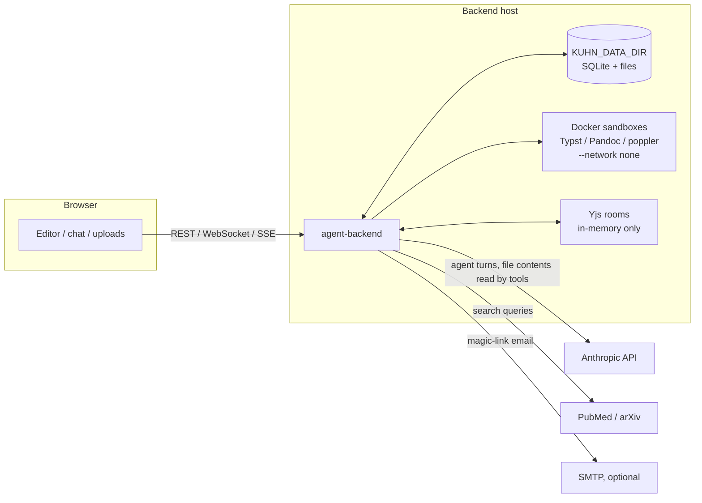

# Kuhn data & file pipeline

**Audience:** an organization (or its IT/security reviewer) evaluating Kuhn and
asking: *where does our data go, how is it processed, and what is persisted?*
**As of:** 2026-07-19 (story 008-001). File references point into `agent-backend/src/`
unless noted. For system architecture see [architecture.md](architecture.md).

Kuhn is self-hosted: one Node backend, one browser app, an in-process SQLite
database, and a data directory on the host you run it on. There is no Kuhn
cloud service. Data leaves your machine only through the four egress paths in
[§5](#5-what-leaves-the-machine).

## 1. Data at rest

Everything lives under one directory, `KUHN_DATA_DIR` (default: repo-root
`./data`, gitignored — `config.js`):

| Location | Contents |
|---|---|
| `data/db/kuhn.sqlite` (override: `KUHN_SQLITE_PATH`) | The database — see table below. In-process better-sqlite3, WAL mode; no DB server. |
| `data/files/<projectId>/` (override: `PROJECTS_ROOT`) | Project workspaces: drafts, uploads, agent-written files, `references.bib`, rendered intermediates. Each workspace also carries a `.git` version-history repo (story 008-002) that is invisible to every application surface. |
| `data/orgs/<orgId>/library/<docId>/<filename>` (override: `ORGS_ROOT`) | Org knowledge-library originals, one directory per document. |
| `data/files/.render-tmp/` | Scratch dirs for render/export output, removed after each run. |

### What the database holds

| Table(s) | User content |
|---|---|
| `messages`, `conversations`, `jobs` | **Full chat transcripts** (user + assistant text, tool calls) and agent task records including the request text. Append-only; kept indefinitely. |
| `bib_references` | Per-project bibliography metadata, including abstracts fetched from PubMed. |
| `org_document_chunks` + `org_chunks_fts` | **Extracted plaintext** of ingested org-library documents, chunked and full-text indexed. Derived from your uploads (see §3). |
| `org_documents` | Library doc metadata: filename, size, sha256, status, uploader. |
| `users`, `memberships`, `organizations` | Identity: **email and display name are the only PII stored**. |
| `sessions`, `auth_tokens` | Login state — only sha256 hashes of secrets, never the tokens themselves (`db/auth.js`). |
| `file_events`, `file_seen` | File activity log (paths + who/when, not contents), pruned to the newest 1,000 per project. `file_events.meta` is a JSON sidecar; a `moved` row stores `{"from": <old path>}` and its `path` is the NEW path. The log is append-only — a move never rewrites history at the old path. |
| `comments` | **Margin-comment threads** (story 008-004): comment bodies, the quoted document excerpt each thread anchors to, author (user id or agent slug), resolve state. Kept until deleted by their author or their project. |
| `agents`, `tools`, `agent_tools`, `projects` | Configuration: agent system prompts, tool grants, project config. |

### Retention and deletion

- **No automatic retention limits.** Chat transcripts, project files, and
  library documents are kept until explicitly deleted. There is no soft
  delete: file and library deletions remove bytes and rows immediately;
  deleting a project cascades its conversations, messages, jobs, references,
  and activity log.
- **Project files have point-in-time history** (story 008-002): a git repo
  per project workspace, committed on explicit saves, coalesced autosaves
  (default one commit per 2 minutes of activity, `KUHN_HISTORY_AUTOCOMMIT_MS`),
  agent-job boundaries, and immediately before deletes/overwriting uploads.
  Restore is append-only (a restore is itself a new version); history is
  removed with the project. This covers *files* only — the database (chat
  transcripts, references, library text) still has no versioning or backup.
- Deleting a user removes their sessions; their past messages/files remain
  with the attribution nulled (schema `ON DELETE SET NULL`).
- Expired auth tokens/sessions are pruned opportunistically; the activity log
  self-prunes (above).
- **No built-in backups.** Durability of `KUHN_DATA_DIR` is the host's job.

## 2. How content enters the system

All file writes — user or agent — funnel through one module, `storage.js`,
which enforces the per-project root (no traversal, no symlink escape, no
absolute paths) and a per-file cap of 20 MB (`STORAGE_MAX_FILE_BYTES`).

| Path | Route / mechanism | Notes |
|---|---|---|
| Project upload | `POST /api/projects/:id/files/upload` (`routes/files.js`) | Multipart, ≤20 files per batch, buffered in memory, any file type accepted. Logged to the activity feed. |
| Editor autosave | `PUT /api/projects/:id/file` | Debounced writes from the editor (rich and source mode). Deliberately not activity-logged. |
| Agent writes | `write_file` / `edit_file` / `move_file` tools (`agents/runtime.js`) | Same storage module, same limits; logged to the activity feed with the acting agent. Agent writes to `draft/**` do **not** touch the file: they land as pending suggestions (`pending_edits` table, story 008-001) the PI reviews per-hunk in the editor; only acceptance writes the file, activity-logged and version-committed under the originating agent/job — "an AI edited my manuscript" becomes "I approved these changes". The seeding pipeline's first draft is the deliberate exception (direct write). |
| Org library upload / promote | `routes/org-library.js`, `routes/projects.js` | Deduplicated by sha256 within the org; triggers ingestion (§3). |

Every route resolves the requesting user first and checks org membership;
non-members get 404s (existence is not leaked).

## 3. Processing

- **Org-library ingestion** (`ingest.js`): uploaded documents are converted to
  plaintext for search — markdown/text read in-process; `.docx`/`.odt`/HTML/RTF/EPUB
  via **Pandoc in a Docker sandbox**; PDF via **poppler `pdftotext`** in a
  sandbox (≤200 pages; scanned/image-only PDFs fail — there is no OCR). The
  text is chunked (~3.2k chars, heading-aware) into `org_document_chunks` and
  FTS-indexed. Original bytes are kept; re-ingestion replaces chunks.
- **Render & export** (`render.js`, `sandbox.js`): markdown → Typst → PDF
  preview, and Pandoc `.docx`/`.tex` export. All of it runs in Docker with
  `--network none`, CPU/memory/pid limits, a 60s kill timer, and the project
  mounted **read-only**; output goes to a scratch dir that is read back and
  deleted. Sandbox output is treated as untrusted. Images:
  `ghcr.io/typst/typst`, `pandoc/core`, `minidocks/poppler`.

## 4. Ephemeral state (lost on restart, by design)

- **Live collaboration**: Yjs document rooms are **memory-only**
  (`yjs-websocket.js`). Durability comes from the editor's autosave writing
  to storage; a crash loses only not-yet-autosaved keystrokes. Rooms are
  destroyed 30s after the last client leaves, and evicted immediately when
  their file is deleted or replaced (story 038). A **move** evicts the old
  room — and, for a folder move, every room beneath it — with close code
  **4002 carrying the new path**, so connected clients re-open there instead
  of treating the document as deleted (story 012-002). The reason is computed
  per room, and blanked when the path exceeds the 123-byte WebSocket close
  limit; a client that gets a blank reason parks the tab rather than guessing.
  A moved room name is also **tombstoned** (story 012-004): joins at or under
  the moved prefix are bounced with the same 4002 + new-path verdict instead
  of recreating an empty room, so a client that ignores the close (any
  pre-012 tab) cannot resurrect the old path and edit a ghost. Tombstones are
  in-memory and cleared the moment the path is live again (a move back, or
  any file event at it); a 5-minute TTL reaps the rest.
  Clients always build a **fresh `Y.Doc` per room join** — reusing one, or
  mutating `provider.roomname`, reintroduces the duplicate-doc merge hazard.
- **Event feeds**: project/org SSE hubs are in-memory pub/sub; only
  `file_change` events are persisted (to `file_events`).
- **Running agent state**: the live run registry is in-memory; jobs orphaned
  by a restart are marked `interrupted` at startup.

## 5. What leaves the machine

| Destination | When | What is sent |
|---|---|---|
| **Anthropic API** (via the Claude Agent SDK) | Every agent turn (chat, `/write`, seeding, review…) | The agent's system prompt, your message + editor context, prior turns, and **any project file contents the model reads with its tools** (`read_file`, `search_files`, org-library search results). Agents `ra`/`advisor` also have Anthropic-side `WebSearch`/`WebFetch`, which fetch model-chosen URLs. Provider-side retention/training is governed by **your Anthropic account settings**, not this repo. Credentials come from the environment (`ANTHROPIC_API_KEY` in `agent-backend/.env`); the code never sees or logs them. |
| **NCBI PubMed** | `/cite` picker, `pubmed_search`, `add_citation` | Search query text and PMIDs. No API key; rate-limited ~3 req/s. |
| **arXiv API** | `arxiv_search` tool | Query string. |
| **SMTP** (only if `KUHN_SMTP_URL` is set) | Magic-link login | Recipient email + login URL. **Without SMTP the link is printed to the server console** — fine for dev, not for shared logs. |

No other outbound calls exist in the backend. The webapp itself talks only to
the backend (plus Google Fonts in `index.html`).

## 6. Identity, access, tenancy

- **Auth modes** (`KUHN_AUTH_MODE`): `dev` (default) — **no real
  authentication**; identity is a header or a seeded dev user, and collab
  WebSocket checks are bypassed. `magic-link` — email link login, signed
  `httpOnly` session cookie (HMAC, 30-day TTL), required `KUHN_SESSION_SECRET`.
  The same session cookie authorizes collaboration WebSockets at upgrade time.
- **Tenancy**: every file operation is confined to its project directory by
  `storage.js`; every route and WS room is org-membership-checked; agents
  derive their org server-side from the task's project and can never address
  another tenant. The only cross-project surface is the org's own knowledge
  library, read-only, within the same org.
- **Abuse limits**: per-task token budget (default 2.5M, hard interrupt),
  50-turn cap, bounded sub-agent dispatch depth.

## 7. Production checklist

Before pointing real users (or a pilot org) at an instance (deployment steps:
[deployment.md](deployment.md)):

- [ ] `KUHN_AUTH_MODE=magic-link` + a strong `KUHN_SESSION_SECRET` (dev mode
      has no authentication at all).
- [ ] `KUHN_SMTP_URL` configured (otherwise login links land in the console).
- [ ] `KUHN_DATA_DIR` on backed-up, access-controlled storage; note there is
      no built-in backup, retention, or at-rest encryption — the host provides
      them.
- [ ] Docker available and the three sandbox images pulled; leave the sandbox
      flags as shipped (`--network none`, read-only mounts).
- [ ] Anthropic account/org configured with your intended data-handling
      settings; understand that project content read by agent tools is sent
      to the API (§5).
- [ ] Front the backend with TLS (the session cookie is `secure` only when
      `KUHN_APP_URL` is https).
