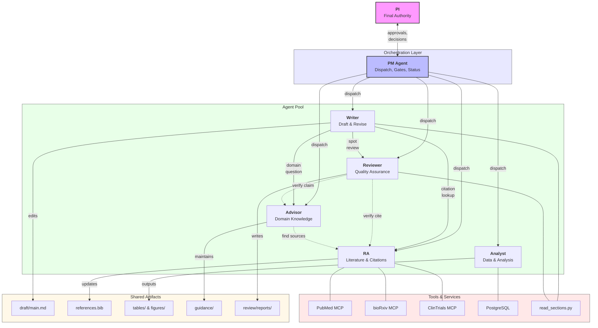
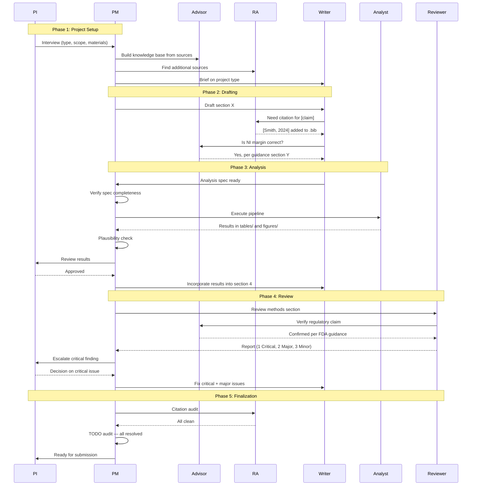

# Agent Interaction Patterns — Requirements Baseline

**Story:** [001 — Map Current Agent Patterns](stories/001-map-current-patterns.md)
**Date:** 2026-04-13

This document catalogs the interaction patterns in the current `agents/` architecture.
It serves as the requirements baseline for the orchestration layer — any solution must
be able to express these patterns programmatically.

---

## 1. Agent Roster

| Agent | Role | Edits deliverables? | Primary workspace |
|-------|------|---------------------|-------------------|
| **PM** | Orchestration, configuration, quality gates | No (status files only) | `pm/` |
| **Writer** | Primary document author | Yes — sole editor of `draft/main.md` | `writer/` |
| **Analyst** | Quantitative analysis, data pipelines | No (outputs to `draft/tables/`, `draft/figures/`) | `analyst/` |
| **Advisor** | Domain expertise, knowledge base | No (maintains `guidance/`) | `advisor/` |
| **RA** | Literature search, citation management | No (updates `draft/references.bib`) | `research/` |
| **Reviewer** | Adversarial quality assurance | No (writes to `review/reports/`) | `review/` |

---

## 2. Agent-to-Agent Interactions

### 2.1 Spawn Vectors (who calls whom)

```
PM ──→ Writer      "Incorporate results from draft/tables/X into section Y"
PM ──→ Analyst     "Run analysis pipeline per spec at draft/analysis_spec.md"
PM ──→ Advisor     "Build knowledge base from guidance/src/; create structured summaries"
PM ──→ RA          "Citation audit on draft/main.md" or "Find sources on [topic]"
PM ──→ Reviewer    "Full review pass on sections [list]"

Writer ──→ RA      "Search PubMed for [topic], add to references.bib, return citation key"
Writer ──→ Advisor  "Domain guidance on [question with context]"
Writer ──→ Reviewer "Review section 3.4 for consistency and citation accuracy"

Analyst ──→ RA      "Find methodological references for [technique]"
Analyst ──→ Advisor  "Methodological guidance on [question]"

Reviewer ──→ Advisor "Verify domain claim against guidance/"
Reviewer ──→ RA      "Verify citation supports attributed claim"

Advisor ──→ RA      "Find additional guidance on [topic]; knowledge base gap" (rare)
```

### 2.2 Interaction Matrix

| Caller ↓ / Callee → | PM | Writer | Analyst | Advisor | RA | Reviewer |
|----------------------|----|--------|---------|---------|-----|----------|
| **PM**               | —  | yes | yes | yes | yes | yes |
| **Writer**           |    | —   |     | yes | yes | yes |
| **Analyst**          |    |     | —   | yes | yes |     |
| **Advisor**          |    |     |     | —   | yes (rare) | |
| **RA**               |    |     |     |     | —   |     |
| **Reviewer**         |    |     |     | yes | yes | —   |

Key observations:
- **PM is the only agent that dispatches to all others** — it is the orchestration hub.
- **RA is never a caller** — it is purely reactive (spawned by others).
- **Writer never calls Analyst directly** — PM mediates that handoff with a quality gate.
- **Analyst never calls Writer directly** — PM mediates with plausibility check.

---

## 3. Dispatch Patterns

### 3.1 PM Fan-Out

The PM coordinates all work. Two modes:

**Sequential dispatch** — when outputs feed into the next step:
```
PM → Analyst: "Run pipeline"
     ↓ (PM checks plausibility)
PM → Writer: "Incorporate results into section 4.1"
     ↓ (PM routes for review)
PM → Reviewer: "Review updated methods section"
     ↓ (PM triages findings)
PM → Writer: "Fix critical issues from review"
```

**Parallel dispatch** — when tasks are independent:
```
PM ──→ RA: "Citation audit"
PM ──→ Advisor: "Summarize new source document"
PM ──→ Reviewer: "Review section 2.1"
     (all run concurrently; PM collects results)
```

### 3.2 Writer → RA Citation Lookup

This is the most frequent inter-agent interaction:

1. Writer encounters a claim that needs a citation
2. Writer spawns RA with a search query: `"Search PubMed for systematic reviews of ketamine RCTs in TRD"`
3. RA searches PubMed via MCP server
4. RA adds entry to `draft/references.bib` (natbib format)
5. RA returns citation key to Writer (e.g., `smith2024`)
6. Writer inserts `[Smith, 2024]` in text

**Characteristics:**
- Synchronous within a session (Writer waits for RA result)
- RA has narrow scope — search, verify, add to bib, return key
- Writer trusts RA's result but may ask for alternatives

### 3.3 Writer → Advisor Domain Questions

1. Writer needs domain guidance (e.g., "Is this NI margin derivation correct per FDA guidance?")
2. Writer spawns Advisor with question + relevant context from the document
3. Advisor consults `guidance/` knowledge base (source documents + structured summaries)
4. Advisor returns a recommended approach first, then alternatives with trade-offs
5. Advisor cites specific sections/pages from source documents
6. Writer incorporates guidance into draft

**Characteristics:**
- Advisor never edits deliverables — only provides sourced answers
- Advisor distinguishes **must** (requirement) / **should** (recommendation) / **may** (suggestion)
- Advisor flags ambiguities or gaps; may request RA to find more sources

### 3.4 PM → Reviewer Adversarial Review

1. PM dispatches Reviewer after major Writer revisions
2. Reviewer reads target sections via `read_sections.py`
3. Reviewer may spawn Advisor (verify domain claims) or RA (verify citations)
4. Reviewer produces report in `review/reports/review_<topic>_<date>.md`
5. Report classifies findings by severity: Critical / Major / Minor / Note
6. PM triages: Critical → PI, Major → Writer, Minor → Writer (lower priority)

**Characteristics:**
- Reviewer never drafts text or runs analyses — only identifies issues
- Review scope varies by project type (regulatory compliance for FDA protocols, rigor for grants, etc.)
- Reviewer checks both section-level detail and cross-section consistency

### 3.5 Writer → Analyst (PM-Mediated)

Writer and Analyst never interact directly. PM mediates:

1. Writer produces analysis specification → `draft/analysis_spec.md`
2. PM verifies spec is complete and actionable (quality gate)
3. PM dispatches Analyst to execute
4. Analyst produces outputs → `draft/tables/*.csv`, `draft/figures/`, `draft/*.md`
5. PM runs plausibility check (numbers make sense? unexpected patterns?)
6. PM dispatches Writer to incorporate (after PI approves)

---

## 4. Approval Gates

### 4.1 PI Intervention Points

The PI (Principal Investigator) is the final authority. PI approves:

| Gate | Trigger | What PI Reviews |
|------|---------|-----------------|
| **Scientific decisions** | Writer proposes design choice | Methodology, endpoints, margins |
| **Structural changes** | Writer proposes major restructure | Document organization |
| **Analysis spec** | Writer completes spec, before Analyst starts | Spec completeness, appropriateness |
| **Analyst results** | Analyst delivers, before Writer incorporates | Plausibility, interpretation |
| **Critical review findings** | Reviewer flags Critical severity | Scientific validity, regulatory compliance |
| **TODO deferral** | Unresolved TODOs at submission time | Explicit acceptance of gaps |
| **Consequential decisions** | Any agent surfaces a judgment call | Regulatory, scientific, design decisions |

### 4.2 PM as Gatekeeper

PM enforces quality gates without PI involvement:

| Gate | When | What PM Checks |
|------|------|----------------|
| **Spec completeness** | Before dispatching Analyst | All required sections present, actionable |
| **Result plausibility** | After Analyst delivers | Numbers reasonable, no unexpected patterns, subgroups flagged if underpowered |
| **Citation audit** | Before major milestones | No unmatched, ambiguous, or orphaned citations |
| **TODO audit** | Before submission | All TODOs resolved or explicitly deferred |
| **Review triage** | After Reviewer reports | Critical → PI, others → Writer |

### 4.3 Escalation Path

```
Agent detects issue
  → PM evaluates severity
    → Minor/Major: route to appropriate agent for fix
    → Critical: escalate to PI
    → If ambiguous: escalate to PI (never silently resolved agent-to-agent)
```

**Principle:** No silent consensus on anything affecting scientific validity or regulatory compliance.

---

## 5. Tool Use per Agent

### 5.1 MCP Servers

Configured in `.mcp.json`:

| Server | Used By | Purpose |
|--------|---------|---------|
| **PubMed** (`@cyanheads/pubmed-mcp-server`) | RA, Writer | Citation search, article fetch, MeSH lookup |
| **bioRxiv** (hosted at `mcp.deepsense.ai`) | RA | Preprint literature search |
| **ClinicalTrials.gov** (native MCP) | RA | Trial search, investigator lookup |
| **Google Docs** (`@a-bonus/google-docs-mcp`) | Writer, PM | Direct document reading/editing (legacy) |

### 5.2 Scripts

| Script | Used By | Purpose |
|--------|---------|---------|
| `scripts/read_sections.py` | Writer, Reviewer, PM, RA | Section extraction, TODO audit, citation audit, TOC |
| `scripts/comments_cli.py` | Writer, PM | Filter Google Docs comment exports |
| `scripts/doc_index.py` | Writer | Google Docs character index tracking |
| `writer/scripts/generate_figure_shells.py` | Writer | Generate mock figure placeholders |
| `analyst/src/main.py` | Analyst | Pipeline orchestrator |
| `analyst/src/power_analysis.R` | Analyst | Propensity score IPTW + power calc |

### 5.3 File I/O per Agent

| Agent | Reads | Writes |
|-------|-------|--------|
| **PM** | `pm/status.md`, `draft/main.md` (via scripts), all agent outputs | `pm/status.md`, `pm/decisions.md`, `pm/issues.md` |
| **Writer** | `draft/main.md`, `draft/references.bib`, `draft/tables/`, `draft/figures/`, `guidance/` | `draft/main.md`, `draft/edits.md` |
| **Analyst** | `draft/analysis_spec.md`, database (Postgres) | `draft/tables/*.csv`, `draft/figures/`, `draft/*.md` |
| **Advisor** | `guidance/**` (knowledge base + sources) | `guidance/<project-type>/*.md` (structured summaries) |
| **RA** | `draft/main.md` (citation audit), `research/litreview/` | `draft/references.bib`, `research/reviews/`, `research/summaries/`, `guidance/*/src/` |
| **Reviewer** | `draft/main.md` (via scripts), `guidance/`, `draft/references.bib` | `review/reports/review_*.md` |

### 5.4 External Services

| Agent | Service | Purpose |
|-------|---------|---------|
| **Analyst** | PostgreSQL (Osmind OMOP) | EHR data queries |
| **Analyst** | RxNav API | Drug classification lookup |
| **Analyst** | Census API | ZIP-level income data |
| **RA** | PubMed API (via MCP) | Literature search |
| **RA** | bioRxiv API (via MCP) | Preprint search |
| **RA** | ClinicalTrials.gov (via MCP) | Trial registry |

---

## 6. Context Management

### 6.1 The Core Problem

Scientific documents grow large (1,750+ lines in the current RWE protocol). LLM context
windows cannot hold the full document plus agent instructions plus conversation history.

### 6.2 Section-Based Editing

The primary solution is `scripts/read_sections.py` (1,300 lines):

```bash
# Get document outline (headings only)
python3 scripts/read_sections.py draft/main.md

# Extract one section (includes all sub-sections)
python3 scripts/read_sections.py draft/main.md 3.4

# Extract multiple sections
python3 scripts/read_sections.py draft/main.md 3.4 4.2

# Extract by title (for unnumbered sections)
python3 scripts/read_sections.py draft/main.md "Methods"

# Decompose entire document into per-section files
python3 scripts/read_sections.py draft/main.md --split /tmp/sections

# Reassemble from per-section files
python3 scripts/read_sections.py draft/main.md --assemble /tmp/sections
```

### 6.3 Who Uses What

| Agent | Context Strategy |
|-------|-----------------|
| **Writer** | Extract target section(s), edit, reassemble. Never loads full document when large. |
| **Reviewer** | Extract sections for focused review; full read only for cross-section consistency. |
| **RA** | Citation audit via `--citations` flag; doesn't need document content. |
| **PM** | Outline + TODO audit; rarely needs full content. |
| **Analyst** | Reads analysis spec only; doesn't touch main document. |
| **Advisor** | Reads knowledge base sections; doesn't touch main document. |

### 6.4 Citation Convention as Context Management

Using `[Author, Year]` instead of numeric `[1]` citations avoids renumbering chaos when
sections are edited independently. The `--citations` audit reconciles in-text citations
against `references.bib` without needing section order.

### 6.5 Session Boundary Management

Context is lost between Claude sessions. Mitigations:
- **CLAUDE.md files** — hierarchical project instructions loaded every session
- **`pm/status.md`** — current state, action items, blockers
- **`pm/decisions.md`** — design decision log with rationale
- **TODO markers** — `[TODO: ...]` in document track open work items
- **Git history** — tracks all changes

### 6.6 Webapp Implications

The webapp must provide programmatic equivalents:
- **Section extraction API** — extract/replace sections by heading number or title
- **Document outline API** — return heading tree without full content
- **Citation audit API** — reconcile in-text citations with bibliography
- **TODO tracking** — surface and manage TODO markers
- **Persistent conversation history** — eliminates session boundary problem

---

## 7. Essential vs. Nice-to-Have for Webapp

### 7.1 Essential — Must Support

These patterns are load-bearing for the core workflow:

| Pattern | Why Essential |
|---------|--------------|
| **PM → Agent dispatch** | Core orchestration; every workflow starts here |
| **Writer → RA citation lookup** | Most frequent interaction; scientific writing requires citations |
| **Writer → Advisor domain questions** | Grounds writing in authoritative sources |
| **PM → Reviewer review cycle** | Quality assurance before any deliverable |
| **PM-mediated Writer↔Analyst handoff** | Quantitative results must flow into document |
| **PI approval gates** | Human oversight is non-negotiable for scientific work |
| **Section-based editing** | Documents will exceed context limits |
| **Citation audit** | Bibliography integrity is a hard requirement |
| **TODO tracking** | Prevents gap-filling; tracks open work |
| **Markdown interchange** | Agent-friendly, human-readable, git-trackable |
| **Streaming responses** | Writer agent must stream into editor |
| **Conversation history** | Eliminates session boundary context loss |
| **Parallel dispatch** | PM must run independent tasks concurrently |

### 7.2 Nice-to-Have — Can Defer

| Pattern | Why Deferrable |
|---------|----------------|
| **Reviewer → Advisor/RA sub-spawns** | Reviewer can work from own knowledge initially |
| **Advisor → RA gap-filling** | Rare pattern; advisor can flag gaps for PM to route |
| **Analyst → Advisor/RA spawns** | Analyst can receive guidance via PM mediation |
| **Google Docs MCP** | Legacy integration; webapp replaces this |
| **`comments_cli.py`** | Google Docs specific; not needed in webapp |
| **`doc_index.py`** | Google Docs specific; not needed in webapp |
| **Full split/assemble workflow** | Section extraction sufficient; batch decompose is power-user |
| **Knowledge base auto-growth** | Can seed manually; auto-expansion is optimization |
| **Multi-project-type matrix** | Start with one project type; generalize later |
| **Adversarial review loops** | Defer per prototype scope in use-case spec |
| **PM status file management** | Database replaces file-based status tracking |

### 7.3 Pattern Changes for Webapp

Some patterns must transform, not just be replicated:

| Current (CLI/file-based) | Webapp Equivalent |
|--------------------------|-------------------|
| Spawning a Claude subagent in terminal | Backend API dispatches agent request to LLM |
| Markdown files as handoff artifacts | Database records + API responses |
| `read_sections.py` CLI tool | Server-side section extraction service |
| `.bib` file on disk | Database-backed bibliography with BibTeX import/export |
| `pm/status.md` flat file | Database project state + real-time UI |
| Session-to-session context loss | Persistent conversation history in DB |
| PI reviews in terminal | UI approval workflows (accept/reject/comment) |
| MCP server connections per session | Backend-managed MCP connections (persistent) |

---

## 8. Interaction Flow Diagram



### Sequence: End-to-End Document Writing



---

## 9. Webapp Orchestration Requirements Summary

Based on the patterns above, the orchestration layer must support:

1. **Agent registry** — define agents with roles, capabilities, allowed artifacts
2. **Dispatch** — PM (or system) sends tasks to agents; agents can spawn sub-agents
3. **Streaming** — LLM responses stream to frontend in real-time
4. **Conversation history** — persistent per-agent and per-project
5. **Artifact management** — structured access to documents, bibliography, tables, figures, knowledge base
6. **Section extraction** — programmatic equivalent of `read_sections.py`
7. **Quality gates** — configurable checkpoints that require human approval before proceeding
8. **Tool integration** — MCP servers (PubMed, bioRxiv, ClinTrials), database access, file I/O
9. **Parallel execution** — run independent agent tasks concurrently
10. **Status tracking** — project state, agent activity, blockers (replaces `pm/status.md`)
