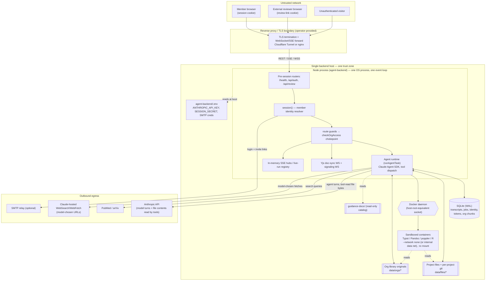

# Kuhn production threat model & data classification

> **Status:** Proposed production-pilot baseline, awaiting human review; revised
> 2026-08-20 (STH-2), 2026-08-31 (STH-16).
> **Scope:** the small-team, single-deployment production pilot defined in
> [ADR 002 — production deployment topology](../adr/002-production-deployment-topology.md).
> **Companion documents:** [architecture.md](../architecture.md) (what the system is),
> [data-pipeline.md](../data-pipeline.md) (operator's data inventory and egress),
> [deployment.md](../deployment.md) (how to run it). This document is the security
> counterpart: trust boundaries, principals, data classes, egress policy, threats,
> and the invariants future reviews enforce.

This document separates the **actual Kuhn implementation** from ADR 002's **proposed
first-team target**. It is not a generic checklist, and the target is not described as
already implemented. Current control claims cite code by path and symbol (with line
ranges only where useful); missing controls point to their owning STH issue.

## 0. Reading this document

Two states are distinguished throughout, because the roadmap is mid-flight:

- **On `main` today** — behavior verifiable in the current tree. `main` boots and
  includes the provider-neutral runtime foundation (ADR 001, landed at
  [`docs/adr/001-provider-agnostic-runtime-foundation.md`](../adr/001-provider-agnostic-runtime-foundation.md)
  via [PR #69](https://github.com/soundtrip-health/kuhn/pull/69)) and the restored
  knowledge-catalog modules (`routes/knowledge.js`, `db/knowledge-catalog.js`, seeded
  from `guidance-docs/catalog.json` — [PR #70](https://github.com/soundtrip-health/kuhn/pull/70)).
- **Future decision / open issue** — owned by a Linear issue (STH-16…STH-30), not
  yet designed or not yet built.

Separately, ADR 002 describes a **proposed production-pilot target** topology that is
not yet implemented; where this document cites it (§1.3, TB-rows, §6 invariants), the
target is marked as such and is not described as already built.

The threat inventory (§5) maps each significant threat to its owning issue.

---

## 1. System trust boundaries

Kuhn is **self-hosted**. The current implementation is one Node process, one browser
app, in-process SQLite, and a data directory on the host. There is no Kuhn cloud. That
single-process layout is the implementation being assessed, not ADR 002's target: the
proposed pilot stays on one host and keeps one web instance, but separates a worker and
sandbox service. Today, **almost every trust boundary is a logical boundary inside one
OS process**, not a privilege boundary.

### 1.1 Trust-boundary diagram — current implementation

This diagram shows the system **as implemented today**: one Node process, direct
Docker invocation, in-memory registries. The **target production-pilot topology**
(web + worker + sandbox service, DB-backed event/control seam) is a different,
deliberate picture — see the "Pilot topology (target state)" diagram in
[ADR 002](../adr/002-production-deployment-topology.md) and the target boundaries
in §1.3 below.

### 1.2 Boundary inventory

| # | Boundary | Kind | Where it is enforced | Notes |
|---|---|---|---|---|
| B1 | Browser/client ↔ backend | Network (HTTPS) | Reverse proxy + `session()` | The proxy is operator-provided; the app has no TLS of its own. |
| B2 | Authenticated **member** REST API | Trust (session cookie) | `session()` `session.js:116-134`, guards `routes/guards.js:26-64` | Fails closed outside dev (401/503). |
| B3 | External-reviewer **guest** API | Trust (review-link cookie) | `review-auth.js`, mounted **before** `session()` `index.js:44-49` | Confined to `/api/review/*`; no project/path parameter — scope comes from the link row. |
| B4 | Yjs collaboration WebSocket (doc-sync) | Trust (cookie at upgrade) | `collab-auth.js:229-278`; per-message read-only gate `yjs-websocket.js:618-626` | Authorized once at upgrade; 60 s sweep re-checks. |
| B5 | Yjs **signaling** WebSocket (y-webrtc) | Trust (member cookie) | `yjs-signaling.js:42-59` | **Live but no client uses it** — see T-23. Per-connection auth cache is never invalidated. |
| B6 | Agent orchestration / product layer | In-process | `runAgentTask` `runtime.js:78-133` | The `runAgentTask` boundary is the provider-neutral seam; everything above it is Kuhn policy. |
| B7 | Provider/model runtime adapter | In-process (SDK) | Claude Agent SDK `runtime.js:310-331` | `permissionMode: 'bypassPermissions'`; the DB tool allowlist is the only gate. ADR 001 (landed in #69) defines a normalized `AgentRuntime` seam beneath this; its phased implementation is STH-1/STH-7. |
| B8 | Model/provider network egress | Network | SDK → Anthropic API | Deployment credential comes from process environment and is consumed by the SDK in the application process; it is not intentionally sent to the browser/model or logged (`data-pipeline.md` §5). |
| B9 | Kuhn-owned research/search APIs | Network | `agents/search.js`, `citations.js` | PubMed/arXiv, query text only. |
| B10 | Background job execution | In-process | Agent route calls `runAgentTask` inline (`routes/agent.js` task route; `agents/runtime.js` `runAgentTask`) | No separate worker; `agents/runs.js` is only the reconnect cache for question-parked runs. |
| B11 | SQLite persistence | In-process file | `db.js:14-21` (WAL, FK on) | Synchronous; every query blocks the event loop. |
| B12 | Project files | Filesystem | `storage.js` project-root containment `storage.js:80-114` | Symlinks omitted entirely; `.git` segment reserved. Raw serving is policy-gated: the safe-inline allowlist in `raw-content.js` (STH-16) — active/unknown types are never inline documents. |
| B13 | Org knowledge-library files | Filesystem | `storage.js` org-root containment `storage.js:52-60` | Deduped by `(org, sha256)`. Same raw-serving policy as B12; the stored client-supplied `mime` column is metadata only and never decides serving (STH-16). |
| B14 | Per-project git history | Filesystem (`<dir>/.git`) | `history.js:31-37` (`execFile`, no shell) | Inherits full `process.env` into the git child `history.js:33`. |
| B15 | Rendering / ingestion | In-process → sandbox | `render.js`, `ingest.js` → `sandbox.js` | All execution goes through the sandbox; never in-process Typst/Pandoc. |
| B16 | Sandbox execution | Container | `sandbox.js` `buildDockerArgs` | `--network none`, `:ro` project mount, cpu/mem/pids caps, kill timer. Images: Typst/Pandoc/poppler (render/ingest) + the Kuhn-**built** `kuhn/r-analysis` (analyst `run_script`, issue #68b — bigger limits: 5 min/2 CPU/2 GB, env-overridable). Script runs add a second `:ro` mount (`/script`, org-library code) and a writable `/out`; image and interpreter argv are composed server-side (agent input is only the script selector and regex-constrained args), and runs queue behind an in-process semaphore (`sandbox-semaphore.js`, `SCRIPT_MAX_CONCURRENT`). Secrets-enabled script runs (org-secrets store) swap `--network none` for the operator-created **internal** docker network (`SANDBOX_SECRETS_NETWORK`; `docker network create --internal` → no route out, so the no-internet invariant holds) and inject the requested org secrets as `KUHN_SECRET_*` env vars. Values are resolved server-side (`db/org-secrets.js`) and never enter the model context or tool results; a script can still echo what it reads into stdout — accepted residual: org secrets are provisioned by the org for exactly these runs. |
| B17 | Docker/container control plane | Host privilege | `spawn('docker', …)` `sandbox.js:56` | **The web process holds host-root-equivalent Docker access.** This is the sharpest topology boundary — see T-25, STH-21. |
| B18 | SMTP | Network | `mailer.js:10-15` | Optional; unset → links printed to stdout. |
| B19 | Future OIDC / identity provider | Network | *Not built* — STH-18 | Magic-link is the only real-auth mode today. |
| B20 | Reverse proxy / TLS boundary | Network | Operator-provided; `trust proxy` **trusts all hops** `index.js:38` | See T-27 (host-header injection). |
| B21 | Backups | Storage | *Not built* — STH-23 | No backup/restore/retention exists. |
| B22 | Deployment / operator access | Host | `.env`, DB file, `git pull` upgrade | `.env` edit + restart ⇒ self-provisioned super-admin (T-05). |

**The load-bearing observation for the whole model:** B6–B17 are boundaries *inside a
single OS process and its host*. There is no network or privilege separation between
the request handler, the agent runtime, the SQLite file, the project files, and the
Docker socket. Compromise of the web process is compromise of everything the host can
reach, including host-root via Docker. The production topology (ADR 002) narrows the
worst of these — chiefly B17 — and replaces B10 with the cross-process seam below.

### 1.3 Target production-pilot boundaries (ADR 002)

Once ADR 002's worker/sandbox split is implemented (STH-25/STH-21/STH-24), the boundary
inventory grows these rows. They are targets — reviews of the implementing PRs must
check them, and this table supersedes B10/B17's "in-process" characterization for the
target state:

| # | Boundary | Kind | Contract | Security relevance |
|---|---|---|---|---|
| TB-1 | **Web ↔ worker: durable event/control seam** | Cross-process via shared SQLite | Ordered append-only job/domain event rows (worker→web); persisted `ask_user` replies, cancellation, suspension flags (web→worker); optional local wakeup that correctness does not depend on (ADR 002 §2.3) | Event/control rows become integrity- and authorization-bearing state. DB-only effects deduplicate on a Kuhn-owned operation id. Filesystem effects persist intent/preconditions, fence concurrent mutation, reconcile after reclaim, and stop as ambiguous when state cannot prove a safe retry (ADR 002 §2.4). STH-24/STH-25/STH-30. |
| TB-2 | **Web/worker ↔ sandbox service** | Authenticated local RPC | Enumerated operation types carrying logical resource ids, relative paths, and bounded options; peer-authenticated method allowlists; service-owned no-follow staging; no caller-selected host mounts, images, Docker argv, or commands (ADR 002 §6) | The web and worker hold no Docker access; only the isolated sandbox service touches the daemon. This removes arbitrary Docker control and host mounts from a compromised caller, but does not preserve tenant confidentiality after an application process with normal file authority is compromised. STH-21. |
| TB-3 | **Sandbox service ↔ Docker daemon** | Host privilege | The single Docker client; hardened flags, digest-pinned images, own concurrency cap | Replaces B17. A web/worker compromise can *request* enumerated jobs, not run containers. |
| TB-4 | **Worker ↔ model provider / research APIs** | Network egress | Provider/model calls move to the worker; egress policy per §4 | Egress concentration in one non-request-serving process; spend controls (STH-19) live here. |
| TB-5 | **Web + worker ↔ shared SQLite + files** | Multi-process file access | WAL + explicit timeout; short transactions; contention telemetry; `storage.js` chokepoint in both processes | Two processes trust the same durable stores; tenancy invariants must hold identically in both (STH-24 matrix). |
| TB-6 | **Data backup destination** | Storage (off-host) | Encrypted online-backup DB destination + files/orgs under a write barrier (ADR 002 §8.1–8.5) | Contains Confidential data, **no secrets** (T-32). STH-23. |
| TB-7 | **Secret escrow** | Separate security domain | `KUHN_SESSION_SECRET`, future master key; provider credentials preferably reissued (ADR 002 §8.3) | Never co-located with the data backup — ciphertext and key stay in different domains. |

---

## 2. Principals & privilege model

| Principal | How authenticated | Authority | Cited |
|---|---|---|---|
| **Unauthenticated visitor** | none | `/health`, static SPA, `POST /api/auth/request-link`, `POST /api/review/lookup`/`claim` (token-bearing) | `index.js:43-49` |
| **Member — viewer** | `kuhn_session` cookie | Read project/org content; render/export previews; list jobs/traces | matrix `tenancy-matrix.test.js:175-255` |
| **Member — editor** | same | All viewer + write/move/upload files, dispatch agents, answer agent questions, mint/revoke review links, upload to org library, promote to library | `routes/guards.js`, `routes/agent.js:47` |
| **Member — owner** | same | All editor + member/invitation/settings management, org-library delete, promotion approvals; knowledge-catalog selection/reimport | `routes/org-admin.js`, `routes/knowledge.js` (owner-only `PUT …/knowledge/selections`, `POST …/knowledge/reimport`) |
| **External reviewer (guest)** | `kuhn_review_session` cookie | One document, one link; mode `view`/`comment`/`edit`; confined to `/api/review/*` | `review-auth.js:44-51`, `routes/review.js` |
| **Super-admin (platform)** | member cookie **+** `is_superadmin` | Create/rename/suspend/unsuspend orgs. **No tenant-content access.** | `routes/guards.js:71-75`, `db/orgs.js:33-59` |
| **Agent role** | server-side, within a job | The tool set granted to its seeded role; project-scoped | `db/seed-data.js:96-116`, `runtime.js:266` |
| **Sub-agent** | dispatched by a parent agent | Inherits `projectId`/`userId`; **role is model-chosen** | `runtime.js:1147-1166` |
| **Background worker** | *n/a* — same process | Runs in the web event loop today | `runs.js:22-42` |
| **Provider credential identity** | env var, per process | One `ANTHROPIC_API_KEY` for the whole deployment | `data-pipeline.md:140` |
| **Deployment/operator** | host access | `.env`, DB file, filesystem, Docker | B22 |

### 2.1 The super-admin invariant (validated against code)

> **Platform authority (`users.is_superadmin`) grants no access to any tenant's
> content. It is lifecycle-only: create, rename, suspend, unsuspend organizations.**

This is not aspirational — it is enforced structurally and was verified by reading
every read site of the flag:

- `is_superadmin` is read in exactly **one guard**, `requireSuperadmin`
  (`routes/guards.js:71-75`), which gates only `POST /api/orgs`,
  `GET /api/admin/orgs`, `PATCH /api/admin/orgs/:id` (`routes/orgs.js:58-196`).
- The tenancy chokepoint `checkOrgAccess(userId, orgId, minRole)`
  (`db/orgs.js:33-59`) — the sole path to every project/file/document/transcript
  route — **never reads the flag**; the invariant is stated in-code at `db/orgs.js:5-7`.
- Consequently a super-admin who is a member of nothing gets a non-leaking **404 on
  every tenant route**, pinned by `tenancy-matrix.test.js:296-305` and
  `tenancy-matrix.test.js:380-395`
  (super-admin creates an org, `member===false`, then `GET …/library` → 404).
- `POST /api/orgs` with `userId: null` creates an org with **no membership**
  (`db/orgs.js:178-192`) — the creator deliberately gets no content access.

**Residual escalation path (by design, worth modelling):** a super-admin can create a
*new* org naming themselves owner, and `KUHN_SUPERADMIN_EMAILS` is synced from env at
every boot (`db/init.js:226`, `db/users.js:14-34`). Anyone who can edit `.env` and
restart the process can make themselves super-admin — but still cannot read an
*existing* tenant's content without an owner issuing them an invitation. This keeps the
content boundary intact even against a rogue operator, up to the point where the
operator simply reads the SQLite file directly (which host access always permits). See
T-05.

---

## 3. Data classification

Kuhn's product is confidentiality-sensitive by nature (unpublished manuscripts, grant
material, protocols, uploaded source documents, organizational knowledge). The scheme
below is deliberately **four sensitivity tiers**, not ten bureaucratic ones:

- **Secret** — credentials and session/link secrets. Disclosure is immediate compromise.
- **Confidential** — tenant content and derived text. The reason customers ask about
  isolation before uploading a protocol.
- **Internal** — identity, configuration, audit, operational telemetry.
- **Public/Shared** — the Kuhn-curated guidance catalog and other non-tenant data.

**Tenant scope** is the second axis and matters as much as tier: a class is
*tenant-scoped* (belongs to one org), *org-wide* (shared across projects/users within
that tenant), *user-scoped*, *cross-tenant product content* (the curated catalog), or
*deployment-scoped*.

### 3.1 Classification table

Columns: **Tier** · **Scope** · **Persistence** · **Enc-at-rest expectation** ·
**Backup expectation** · **Retention/deletion** · **May appear in logs?** ·
**Model/provider egress** · **Research-provider egress** · **Export**.

| Data class | Tier | Scope | Persistence | Enc-at-rest | Backup | Retention/deletion | In logs? | Model egress | Research egress | Export |
|---|---|---|---|---|---|---|---|---|---|---|
| **Unpublished drafts / project files** | Confidential | Tenant/project | `data/files/<projectId>/` + per-project `.git` | **Required** (host-provided; STH-23) | Required (files + `.git`) | Deleted with project, immediately; git history removed too | No | **Yes** — when a tool reads them (`read_file`, `search_files`) | No | Per-file Pandoc `.docx`/`.tex` |
| **Uploaded source documents** (project) | Confidential | Tenant/project | same, any type, ≤20 MB | Required | Required | With project/file | No | Yes (if read by a tool) | No | Same |
| **Organization knowledge (library originals)** | Confidential | Org-wide (shared across projects within one tenant) | `data/orgs/<orgId>/library/` | Required | Required (not reconstructible from DB — only sha256+chunks persist) | Owner delete removes bytes+chunks immediately | No | Via `search_org_knowledge` results | No | Per-document content fetch |
| **Org document chunks / FTS text** | Confidential | Tenant (org) | `org_document_chunks`, `org_chunks_fts` (SQLite) | Required (DB-level) | Required | Replaced on re-ingest; removed with doc | No | Via search results injected into prompts | No | No |
| **Agent system prompts** | Internal | Deployment (seeded) | `agents` table | Standard | Required | Versioned via seed | Prompt text may; no secrets | Sent as system prompt every turn | No | No |
| **Agent conversations / transcripts** | Confidential | Tenant/project | `messages`, `conversations`, `jobs` — **full model I/O incl. tool-read file contents** `runtime.js:357-419` | **Required** | Required | **Kept indefinitely; no retention** `data-pipeline.md:61-65` | Should not (bodies) | Are the model turns | No | Via `/jobs/:id/trace` to any project viewer |
| **Tool inputs / results** | Confidential | Tenant/project | in `messages` (tool_use/tool_result bodies) | Required | Required | With conversation | Should not | Round-tripped through the model | Search tools send query text | Trace endpoint |
| **Comments / review feedback** | Confidential | Tenant/project | `comments` (bodies + quoted excerpt) | Required | Required | Until author/project deletes | No | If read by a tool | No | No |
| **Citations / bibliographic metadata** | Internal→Confidential | Tenant/project | `bib_references` (incl. PubMed abstracts) | Standard | Required | With project | Query text may | If read | **Query text + PMIDs to PubMed/arXiv** | `.bib` in workspace |
| **User identity / membership** | Internal | User / deployment | `users`, `memberships`, `organizations` — **email + display name only PII** | Standard | Required | User delete keeps content with attribution nulled (`ON DELETE SET NULL`) | Email appears in login-link logs | Reviewer display name server-stamped into Yjs awareness | No | No |
| **Auth tokens / session cookies** | **Secret** | User | `sessions`, `auth_tokens` — **sha256 hashes only**, never raw `db/auth.js` | **Required** | Required (but rotating `SESSION_SECRET` invalidates all) | Expired pruned opportunistically; **no revoke on role change** | **Raw token must never log** (does today if SMTP unset — T-08) | **Never** | Never | Never |
| **Invitation / review-link secrets** | **Secret** | Org / link | `invitations`, `review_links` — sha256 only | **Required** | Required | Single-use / TTL; revoke deletes sessions | **Invitation** raw token logs today when SMTP unset (T-08). **Review-link** raw tokens are *never* mailed or printed — returned once in the mint response only (`routes/review-links.js:56`); their exposure is the URL path/history/proxy logs (T-15) | Never | Never | Never |
| **Provider credentials** (`ANTHROPIC_API_KEY`, SMTP URL) | **Secret** | Deployment | `agent-backend/.env` / process environment | **Required** (host) | **Never in the data backup — reissued/rotated at restore; escrowed only if not reissuable** (ADR 002 §8.3) | Manual | **Never intentionally**; application/SDK code can read process env and current host child processes inherit it | Credential value: never; model traffic uses it for authentication | Never | Never |
| **Provider/model configuration** | Internal | Deployment (today) / future org BYOK | `agents.model`, `config.js` | Standard | Required | Config | Non-secret | n/a | n/a | n/a |
| **Org secrets** (data-service DSNs, API keys) | **Secret** | Org | `org_secrets` — AES-256-GCM ciphertext only (`db/org-secrets.js`); key from `KUHN_SECRETS_KEY` or derived from the session secret | **Required** | Ciphertext may ride in the DB backup; the KEY must not (TB-7) | Editor-managed; values write-only (replace to rotate) | Names may appear in audit meta; values never intentionally | Never — resolved server-side and injected only into sandbox env / outbound API params | Never | Never |
| **Audit events** | Internal | Org/user | `auth_events` (`invite.*`, `org.*`, `knowledge.*`) | Standard | Required | Kept; **nothing reads them today** `db/auth-events.js:2` | Safe fields | No | No | No |
| **Logs / metrics / traces** | Internal (may embed Confidential) | Deployment | stdout/journald today | n/a | Operator | Operator | — | Must redact secrets & content | — | — |
| **Git history (per project)** | Confidential | Tenant/project | `<projectDir>/.git` | Required | **Required — inside the workspace, easily missed** | Removed with project | No | Contents are the files | No | No |
| **Data backup** | Confidential | Deployment (all tenants) | *Not built* — STH-23; online-backup DB destination + `data/files/` + `data/orgs/` + recorded app/schema version (ADR 002 §8.1–8.2). **Contains no secrets** | **Required (encrypted)** | — | Generational retention to define | Never | Never | Never | The DR artifact (with the matching app artifact + escrow) |
| **Secret escrow** | **Secret** | Deployment | *Not built* — STH-23; **separate security domain** (ADR 002 §8.3): `KUHN_SESSION_SECRET`, any future master key; SMTP cred only if not reissuable. Never co-located with the data backup | **Required + independently protected** | — | Rotate on incident/restore | Never | Never | Never | Never |

### 3.2 Notes that change how the classes are handled

- **Transcripts are the highest-volume Confidential store and the least protected.**
  Every model turn — including the *contents of any project file a tool read* — is
  persisted to `messages` (`runtime.js:357-364`, `runtime.js:405-419`) and is retrievable by any
  **project viewer** through `GET /api/agent/jobs/:id/trace` (`routes/agent.js:86-95`).
  A viewer who never had file-write access can read, via a trace, file contents an
  agent surfaced. Kept indefinitely with no retention control. This is the single
  largest "more people can read it than you'd expect, forever" surface.
- **Org-library originals are not reconstructible from the database.** The DB holds
  sha256 + extracted chunks only (`schema.sql:290-315`). A backup that captures the DB
  but not `data/orgs/` loses the source documents. (STH-23.)
- **Token/link secrets are hashed at rest in the DB** (`db/auth.js`), and sandbox
  containers receive no credential environment (`sandbox.js` passes no
  `-e`/`--env-file`). Do not overread that control: application/SDK code can access
  process environment, and current `git`/`docker` host child processes inherit it
  (`history.js` `git`; `sandbox.js` `runSandboxed`). STH-20/STH-21 must provide minimal
  explicit child environments. The live transport defects are raw login/invitation
  tokens to stdout when SMTP is unset (T-08) and review tokens in the URL path (T-15).
  Review-link tokens never pass through the mailer/stdout fallback; the raw token
  appears only in the mint response (`routes/review-links.js` mint route).

---

## 4. Provider egress policy

Provider agnosticism (ADR 001, landed via #69; implementation phased under STH-1/STH-7)
must not become "anything can send anything anywhere." This section states the
**architectural expectation**; it does not
implement provider configuration (that is STH-9/STH-20/STH-15).

### 4.1 Egress surfaces that exist today

Four backend outbound paths exist (`data-pipeline.md` §5, verified):

1. **Anthropic API** — every agent turn. Sends the system prompt, the user message +
   editor context, prior turns, and **any project/org content the model reads with its
   tools**. One deployment-wide `ANTHROPIC_API_KEY`.
2. **Claude-hosted `WebSearch`/`WebFetch`** — for roles `ra`/`advisor` only
   (`seed-data.js:103`); fetches **model-chosen URLs** from Anthropic's side. This is a
   provider-specific capability, not a product invariant (ADR 001 §"Hosted web search";
   STH-11 replaces it with Kuhn-owned research tools).
3. **PubMed / arXiv** — query text and identifiers only; no credentials.
4. **SMTP** — recipient email + login/invite URL, only if configured.

Separately, the current browser loads Google Fonts from a third-party origin
(`webapp/index.html`); that leaks ordinary client request metadata and creates an
external asset dependency. The proposed immutable/self-hosted production artifact
should bundle those fonts (STH-29).

### 4.2 Expected policy per provider mode (future-facing, STH-9/STH-12/STH-20/STH-15)

| Provider mode | Credential source | Egress expectation | Cross-tenant separation |
|---|---|---|---|
| **Deployment-managed provider** (today: Anthropic) | Deployment env/secret store | All tenants' content may flow to it; the operator vouches for the provider's data policy | One credential, one destination; documented to owners |
| **Organization BYOK** (future) | Org-scoped secret, referenced by profile, never returned to browser | Only that org's content flows to that org's provider/credential | **Hard**: an org can never reference another org's credential/endpoint by id — STH-20 |
| **Custom OpenAI-compatible endpoint** (future) | Org- or deployment-scoped, allowlisted | Only to explicitly configured base URLs; reject credentials-in-URL, unsafe schemes, loopback/link-local/private/metadata destinations unless an operator explicitly enables a local profile with network policy enforcing that choice | Endpoint is part of the allowlisted profile, not model-selectable |
| **Self-hosted / local model** (future) | Local, possibly no credential | Egress stays on-prem; still an explicit profile | Same |
| **Web search / fetch provider** | Provider or Kuhn-owned | Query + model-chosen URLs; must be a declared capability, off by default for confidential projects | Per-tenant policy |

### 4.3 Provider-side data-handling concerns operators must be able to see

The product must eventually expose to operators/owners (STH-15):

- which provider/model each **role** routes to, and the **endpoint** it egresses to;
- whether that provider logs/trains/retains submitted data (a policy attribute of the
  profile, not something Kuhn can enforce — but it must be *surfaced*);
- **credential isolation**: profiles hold credential *references*, never secret
  material; secrets never enter prompts, model metadata, continuation state, logs, or
  DB-backed tool arguments (ADR 001 §"Credentials and egress");
- **cross-tenant separation**: no org may read, test, or route through another org's
  credential/endpoint by identifier (STH-20, STH-24).

The invariant, stated once: **provider egress is a property of an allowlisted,
tenant-scoped profile — never of model-selectable data.** A model may choose *what to
say*, never *where it goes* or *with whose credential*.

---

## 5. Threat inventory

Severity = qualitative (Critical/High/Medium/Low) for the **pilot** profile (small
trusted team, TLS front, dev-auth *not* used). Each row: asset · attacker &
prerequisite · impact · current control · evidence/test · residual risk · owning issue.

The dominant precondition across the highest-severity threats is **a
misconfiguration** (dev auth in production, missing `KUHN_APP_URL`, SMTP unset) or **a
web-process compromise** (which, given §1's single-zone topology, cascades). The pilot
is defensible primarily because the team is small and trusted and the front door is
TLS + magic-link; several controls that a hostile-multi-tenant SaaS would require are
tracked, not built.

### 5.1 Authentication, session, identity

| ID | Threat | Sev | Attacker / prereq | Impact | Current control | Evidence | Residual | Issue |
|---|---|---|---|---|---|---|---|---|
| **T-01** | **Production silently runs dev auth** — `KUHN_AUTH_MODE` defaults to `dev`; `x-kuhn-user` header becomes identity, auto-joined editor to default org; collab WS checks bypassed | **Critical** | Operator omits the var; any network client | Full-tenant compromise (read/write all content in the default org, writable Yjs on every room) | Docs warn (`deployment.md:52-53`); `assertAuthConfig` only fires *after* opting into non-dev | `session.js:116-123`, `collab-auth.js:124,207`, `config.js:41` | **Not fixed** — no runtime guard refuses dev mode on a non-loopback bind | **STH-17** |
| **T-02** | **Non-Secure session cookie in production** — `secure` flag derived from `KUHN_APP_URL` (`http://localhost:5174` default), not the request | High | Operator forgets `KUHN_APP_URL`; network attacker | Session cookie sent over cleartext → theft | Docs note it; correct when `KUHN_APP_URL` is https | `routes/auth.js:29-31`, `config.js:60` | Config-dependent; boot validation would close it | **STH-17** |
| **T-03** | **Session theft / no revocation on role change** — sessions never invalidated on demotion, member removal, or org suspension | High | Stolen cookie, or removed user | 30-day valid cookie; removed member keeps open SSE feeds and (≤60 s) Yjs writes | Per-request re-auth for *new* requests; 60 s Yjs sweep | `db/orgs.js:136-153`, `routes/orgs.js:170-175`, `yjs-websocket.js:325-340` | Open SSE feeds & running jobs **not** re-checked; no "log out everywhere" | **STH-18**, STH-25 |
| **T-04** | **Login-CSRF / session fixation** — `GET /api/auth/verify` is a state-changing GET that sets the cookie; no CSRF token | Medium | Trick victim into clicking attacker's verify link | Victim lands in attacker-chosen session | `SameSite=Lax` + single-use token limits it | `routes/auth.js:106-125` | Login-CSRF reachable; hardened session lifecycle owes a fix | **STH-18** |
| **T-05** | **Operator self-promotes to super-admin** — `KUHN_SUPERADMIN_EMAILS` synced from env every boot | Medium | Host/`.env` write + restart | Attacker becomes platform admin; can create orgs, suspend others | By design; **still cannot read existing tenant content** (super-admin invariant) | `db/users.js:14-34`, `db/init.js:226`, `db/orgs.js:33-59` | Host access already implies DB read; audit of `.env` changes is external | STH-17/STH-24 (config validation, audit) |
| **T-06** | **Invitation abuse** — invite link is *also* an auth credential; intercept = session as invitee | Medium | Read the emailed link or the stdout log line | Account takeover of the invitee's new membership | Single-use, hashed, TTL, one-live-per-(org,email), suspension-aware | `db/invitations.js:35-118`, `mailer.js:41-44` | Link-in-transit and log exposure (see T-08); redeeming as existing member burns token without changing role | STH-18 (invite/session lifecycle), STH-19 (rate/abuse) |

### 5.2 Authorization & tenancy

| ID | Threat | Sev | Attacker / prereq | Impact | Current control | Evidence | Residual | Issue |
|---|---|---|---|---|---|---|---|---|
| **T-07** | **Cross-tenant access / IDOR** — reference another org's project/doc by id | **High** (baseline risk) | Authenticated member | Read/write another tenant's content | **Strong**: single chokepoint `checkOrgAccess`; org derived from project row, not client input; non-leaking 404; last-owner invariant | `db/orgs.js:33-59`, `routes/guards.js:26-64`, matrix `tenancy-matrix.test.js:175-335` | **Well-controlled today**; the risk is *regression* as provider/worker surfaces are added | **STH-24** (extend matrix + audit) |
| **T-08** | **Auth/invite secrets to stdout** — SMTP unset ⇒ live single-use login & invite links printed to server console (review-link tokens are *not* affected: they never pass through the mailer — minted and returned in-response only, `routes/review-links.js:56`; their URL-exposure risk is T-15) | **High** | Operator runs magic-link without `KUHN_SMTP_URL`; anyone who reads logs | Account takeover from log aggregation | Documented as intended dev behaviour | `mailer.js:19-22,41-44`, `deployment.md:130-137` | **Not fixed** — nothing ties SMTP-configured to auth mode | **STH-17** (fail-closed), STH-26 (log hygiene) |
| **T-09** | **Stale authorization on long-lived streams** — open SSE feed / running job authorized once | Medium | Member removed mid-stream | Continues receiving live project events / agent output until disconnect | Per-request re-auth covers new requests; Yjs swept | `routes/projects.js:316-343`, `routes/agent.js:47-55` | SSE & jobs not re-checked | STH-25, STH-18 |
| **T-10** | **Guest review-link abuse** — guest escapes the linked document | Medium | Holder of a review link | Reach other docs / projects | **Strong**: no path/project parameter; scope from link row; comment ops constrained to the linked doc; per-request DB re-validation; suspension-checked | `review-auth.js:44-51`, `routes/review.js:9-11,84-99`, `db/review-links.js:166-187` | Well-controlled; residual is link-in-URL exposure (T-15) and unthrottled claim attempts (rate/abuse — STH-19) | STH-19 |
| **T-11** | **Super-admin reads tenant content through application authorization** | — (controlled application path) | — | — | The flag is read only in `requireSuperadmin`; the tenant-content chokepoint ignores it | `routes/guards.js:71-75`, `tenancy-matrix.test.js:296-305,380-395` | The invariant holds for application routes; a host operator can still read the underlying DB/files and is outside this application-level guarantee | STH-24 |

### 5.3 Active content, browser origin, uploads

| ID | Threat | Sev | Attacker / prereq | Impact | Current control | Evidence | Residual | Issue |
|---|---|---|---|---|---|---|---|---|
| **T-12** | **Stored active-content (HTML/SVG) on the API origin** — raw-file routes could serve uploaded `.html`/`.svg` as active same-origin documents (single-port ⇒ API origin *is* app origin) | **High** | Any editor or agent writes `evil.html`; a viewer opens it | Same-origin script execution against the (HttpOnly) session cookie: authenticated same-origin API actions as the viewer | **Fixed (STH-16)** — explicit safe-inline allowlist in `raw-content.js`: only text/JSON/raster/PDF serve inline; HTML/SVG/unknown/binary serve as `application/octet-stream` + `Content-Disposition: attachment`; `X-Content-Type-Options: nosniff` on every raw response; project file, history file, org-library content, and reviewer file routes all go through `sendRawFile` | `raw-content.js`, `raw-content.test.js`, `webapp/scripts/raw-content-check.mjs` | No upload-time type restriction (any type stores; active types simply never render) and no CSP on the app origin (defense in depth) | **STH-16** (closed) |
| **T-13** | **Org-library uploader chooses response Content-Type** — `…/library/:docId/content` trusted the stored, client-supplied `doc.mime` (multer's upload mimetype) over the file's own type | High | Org editor uploads a file whose MIME claims `text/html` | Active content served to any org viewer | **Fixed (STH-16)** — stored MIME no longer decides serving: the content route classifies by extension through `rawContentPolicy` (`raw-content.js`), which never consults stored/client-supplied MIME; `doc.mime` is descriptive metadata only | `raw-content.js`, `routes/org-library.js` content route, `raw-content.test.js` | Same residual as T-12 | **STH-16** (closed) |
| **T-14** | **Malicious uploaded document → ingestion** — crafted PDF/docx processed by Pandoc/poppler | Medium | Editor uploads a malformed doc | Parser exploit *inside the sandbox* (network-isolated, `:ro`, capped) | Sandbox contains it; fail-soft ingestion | `ingest.js:41-67`, `sandbox.js:23-36` | Sandbox hardening gaps (T-24); `:latest` parser images (T-26) | STH-21 |
| **T-15** | **Review-link token in URL path** — `/review/<token>` | Medium | Proxy/access logs, browser history, referrer | Token disclosure ⇒ guest session | **Headers fixed (STH-16)** — `Referrer-Policy: no-referrer` on the review shell, so the token URL never rides a referrer to a third party; cosmetic URL rewrite post-claim; single-claim | `index.js` (review-shell branch), `webapp/src/review/main.ts:530-531` | Token still present in the URL path itself (proxy/access logs, browser history) | STH-19 |

### 5.4 Model / agent / tool threats

| ID | Threat | Sev | Attacker / prereq | Impact | Current control | Evidence | Residual | Issue |
|---|---|---|---|---|---|---|---|---|
| **T-16** | **Model-chosen sub-agent role (privilege selection)** — `dispatch_agent.agent_slug` is model-supplied free text; child resolves any seeded role's tool set; **compose-mode not inherited**, so a `/write` run can dispatch a sub-agent that writes files, bypassing the "no `file_change` during `/write`" contract | **High** | Prompt-injected or misbehaving model in any project | Within-project privilege widening; bypass of compose restriction | Bounded only by dispatch depth (≤2) and project scope | `runtime.js:1147-1173`, `runtime.js:219-222`, `runtime.js:1164` | **Not fixed** — role/compose inheritance needs constraining | STH-1/STH-7 (tool registry & runtime seam), STH-24 |
| **T-17** | **Prompt injection via malicious content** — uploaded doc, org-library passage, or web-fetched page instructs the model to exfiltrate or misuse tools | High | Attacker-supplied content reaches a tool result | Data exfiltration to provider egress; unwanted writes (as suggestions under `draft/**`) | `projectId`/`orgId` **never model-supplied** (server-derived); storage containment; `draft/**` writes land as pending suggestions | `runtime.js:266,1013-1028`, storage `storage.js:80-114`, suggestion mode `runtime.js:678-713` | Exfiltration through legitimate egress remains; needs egress policy + web-tool replacement | STH-11, STH-20 |
| **T-18** | **`bypassPermissions` + DB allowlist is the only tool gate** | High | Any prompt-injection foothold | Whatever the granted tool set allows | SDK `tools`/`allowedTools` filtering removes ungranted built-ins entirely (required because bypass makes `allowedTools` alone ineffective) | `runtime.js:34-42,271-275,320-322` | The allowlist is load-bearing; ADR 001 seam (#69) is where a stricter gate lands | STH-1/STH-7 |
| **T-19** | **Unvalidated `sessionId` passthrough to SDK `resume`** — client supplies `sessionId` on `POST /api/agent/task`, passed into SDK `resume` with no ownership check | Medium | Any project editor | Resume/replay a session not one's own; provider-side state confusion | None specific | `routes/agent.js:42,55` → `runtime.js:328` | **Not fixed** | STH-7 (Kuhn-owned continuation), STH-10 |
| **T-20** | **Excessive tool permissions / model-supplied identity** | Medium | Model | Broader capability than a task needs | `projectId`/`orgId` server-derived; file built-ins deliberately not granted; `.bib` write refused | `runtime.js:266,1208-1217` | Role granularity is coarse (any editor runs any role) | STH-1 |

### 5.5 Resource, spend, availability, lifecycle

| ID | Threat | Sev | Attacker / prereq | Impact | Current control | Evidence | Residual | Issue |
|---|---|---|---|---|---|---|---|---|
| **T-21** | **Uncontrolled provider spend / no concurrency ceiling** — no per-user/org/global limit on concurrent runs or dispatches; per-run budget only | **High** | One authenticated editor | Open N SSE task streams; each tree burns ≤2.5 M weighted tokens; unbounded provider bill | Per-run token budget (2.5 M ×1.1) + 50-turn cap + depth ≤2 | `config.js:70-84`, no semaphore (grep-verified) | **Not fixed** — budget is per-dispatch-tree, in-memory, not per-tenant/day | **STH-19** |
| **T-22** | **Resource exhaustion via sandbox fan-out** — render is **viewer**-triggerable; ingestion dispatches via bare `setImmediate`, no queue/limit | High | Any org viewer | N concurrent containers (N×512 MB + N CPUs); host memory/CPU/disk exhaustion (no `--ulimit fsize`) | Per-container caps + 60 s timeout; **`run_script` runs (issue #68b) queue behind an in-process FIFO semaphore (`sandbox-semaphore.js`, `SCRIPT_MAX_CONCURRENT`, default 2)** | `routes/render.js:52`, `ingest.js:186-188`, `sandbox.js` | **Partially fixed** — script runs are capped; render/ingest still have no concurrency cap or queue | **STH-19**, STH-21 |
| **T-23** | **Live-but-unused signaling endpoint** — `/yjs-signaling` mounted and reachable; no client uses it; per-connection auth cache **never invalidated** | Medium | Authenticated member | Generic room-scoped message relay; demoted/removed member keeps publishing for socket life | Member-only (guests refused); per-message topic auth (cached) | `yjs-signaling.js:42-59`, no client import (grep) | **Not fixed** — removable attack surface | STH-24 (or remove) |
| **T-24** | **Sandbox escape → host** — container escape from Typst/Pandoc/poppler | **High** | Malicious document + a container 0-day | Reach the host; the web process runs as a Docker-privileged user | `--network none`, `:ro` project mount, cpu/mem/pids caps, 60 s kill; no credential variables are passed into the container | `sandbox.js:23-36`, verified no `-e` | **Hardening gaps**: no `--user`, `--read-only`, `--cap-drop=ALL`, `--security-opt=no-new-privileges`, `--tmpfs`, `--ulimit fsize`; the host-side `docker` child still inherits the application environment | **STH-21** |
| **T-25** | **Web-process compromise ⇒ host-root via Docker** — the public Node process directly invokes the `docker` CLI; Docker socket access is host-root-equivalent | **Critical** | Any RCE foothold in the web process (e.g. via a dependency) | Full host compromise | None — Docker control is co-resident with request serving | `sandbox.js:56` | **Not fixed** — the central topology finding | **STH-21** (isolate behind a narrow sandbox service; ADR 002 §6) |
| **T-26** | **Supply-chain / unpinned images** — `:latest` for Typst/Pandoc/poppler; no digest pinning | Medium | Upstream image compromise between pulls | Malicious parser runs on untrusted docs | Sandbox contains network; images process untrusted input. The analyst R image (`kuhn/r-analysis`, issue #68b) is locally **built** from `docker/r-analysis/Dockerfile` (rocker base + CRAN packages) — no registry pull at run time, but the base/package supply chain is unpinned like the rest | `config.js` sandbox images | **Not fixed** | STH-21 (pin), STH-28/STH-29 (build gates) |
| **T-27** | **Reverse-proxy / trusted-header mistake** — `trust proxy` trusts *all* hops; magic-link/invite/review URLs built from `req.protocol`+`Host` | High | Direct origin reach, or a proxy that forwards client `X-Forwarded-*` | **Host-header injection**: trigger `request-link` for a victim, emailed login link points at attacker host | Correct behind a proxy that sets the headers and blocks direct reach | `index.js:38`, `routes/auth.js:48`, `routes/orgs.js:109`, `routes/review-links.js:80` | **Not fixed** — production credential URLs must be minted from the canonical configured origin (`KUHN_APP_URL`), removing request Host from the path entirely; bounded `trust proxy` remains defense-in-depth for request metadata | **STH-17**, ADR 002 §7 |
| **T-28** | **Stale/uncontrolled jobs after suspension/removal** — org suspension does **not** kill in-flight agent runs; parked `ask_user` runs live indefinitely with unbounded event buffers | High | Suspended tenant with a run in flight; or any run parked on a question | Suspended tenant keeps mutating files + spending budget until the run ends; memory growth from parked runs | Suspension stops *new* dispatch and `search_org_knowledge`; documented gap | `runtime.js:1029-1033`, `config.js:87-90`, `runtime.js:179-184` | **Not fixed** | **STH-25** |
| **T-29** | **Provider outage / retry storm** — 5-attempt exponential backoff per turn; resume-on-retry can re-stream a half-completed turn | Medium | Provider degradation | Amplified load; duplicated partial output | Full-jitter backoff, cap 30 s; transient classification | `runtime.js:287-307,459-474` | No circuit breaker; no wall-clock run timeout | STH-25/STH-26 |
| **T-39** | **Yjs / WebSocket resource exhaustion** — no doc-sync message-size cap, no per-room memory bound, no per-member connection/room-creation cap; a member can open many rooms or push oversized updates | Medium | Authenticated member (or removed member within the 60 s sweep window) | Web-process memory/CPU growth from oversized Yjs updates and unbounded room/connection creation; degrades the single web instance for every tenant | Auth at upgrade + 60 s sweep; SSE subscriber cap 20/project; only a close-reason byte cap on the WS path | `yjs-websocket.js` (no `maxPayload`/room cap), `config.js:125` (SSE cap), no per-member WS quota (grep) | **Not fixed** — needs WS message-size limits, per-room/connection caps, and matching proxy body limits | **STH-19**, STH-26 |
| **T-40** | **Aggregate storage exhaustion** — per-request upload caps (20 MB × 20) are not a per-tenant storage quota; sustained uploads/imports grow `data/files/` + `data/orgs/` without bound | Medium | Authenticated editor over time; org-library imports | Host disk exhaustion → DB writes, renders, and ingestion fail service-wide; no tenant fair-share | Per-file / per-request size limits only | `config.js:107` (`maxFileBytes`), `routes/uploads.js:14-18` (per-request cap), no aggregate quota (grep) | **Not fixed** — no per-tenant storage quota or retention | **STH-19** (quotas), STH-23 (retention) |
| **T-42** | **Agent-driven code execution (`run_script`, issue #68b)** — the analyst runs R code (org-library scripts or model-authored project scripts) in the sandbox; a model can be prompt-injected into writing hostile code | High | Prompt-injected or misbehaving analyst run; malicious promoted script an owner approves | Hostile code runs against the tenant's own project data inside the container; escape requires a container 0-day (= T-24) | Same B16 invariants (no network, project `:ro`, no credentials, cpu/mem/pids/time caps) **plus**: image + interpreter argv composed server-side (`sandbox.js` — agent chooses only the script selector and regex-constrained args, ADR 002 §6 compatible); org-script code is owner-reviewed at promotion (copy-on-approve, sha-checked); outputs re-enter the project only through `storage.js` (path containment + size cap); every run is recorded in `script_runs` | `agents/runtime.js` run_script tools, `sandbox.js` `runScriptSandboxed`, `routes/scripts.js` approve | Mitigated within the existing sandbox posture; inherits T-24's hardening gaps and T-25's topology finding | STH-21 |

### 5.6 Persistence, durability, operations

| ID | Threat | Sev | Attacker / prereq | Impact | Current control | Evidence | Residual | Issue |
|---|---|---|---|---|---|---|---|---|
| **T-30** | **No backups / incomplete deletion / no export** — no backup, restore, retention, or at-rest encryption; deletes are immediate hard deletes | **High** | Disk failure, ransomware, fat-finger delete | Permanent data loss of manuscripts/grants; no DR; likely data-portability gap | Per-project git history (files only, on-host, deleted with project) | `data-pipeline.md:61-77`, `deployment.md:92-95` | **Not fixed** | **STH-23** |
| **T-31** | **SQLite/file corruption or partial upgrade** — startup runs `DROP TABLE`-based rebuilds on live data; no version table; `initDb` failure **starts the server anyway** | **High** | Any restart after a schema change; crash mid-rebuild | Corrupt/half-migrated DB; a running-but-broken service a supervisor won't catch | Rebuilds are transactional + `foreign_key_check`; WAL | `db/init.js:82-183,211-227`, `index.js:116-119` | **Not fixed** — no migration ledger, no pre-migration backup, no fail-closed | **STH-22**, STH-17 |
| **T-32** | **Recovery-domain compromise** — there is no composite backup; the target recovery design uses two separately protected domains (ADR 002 §8.3, TB-6/TB-7): the encrypted **data backup** (Confidential; no secrets) and the **secret escrow** (`KUHN_SESSION_SECRET`, any future master key; provider credentials reissued at restore, not archived) | High (future) | Compromise of either recovery store | **Data backup alone:** tenant-content disclosure only if its encryption also fails; should yield no credential/secret material. **Escrow alone:** session forgery, and the key to any future ciphertext — but not the data it protects. Full compromise requires both independently protected domains to fall | *Not built* — implementation must keep the domains in separate security stores with separate keys (ADR 002 §8.3) | — | Per-domain encryption + access control; restore preserves tenant isolation; drill-tested | **STH-23** |
| **T-33** | **Operator mistakes during deploy/restore** — upgrade is `git pull && npm install && npm run build`; no reproducible artifact, no rollback, no graceful shutdown (no SIGTERM handler; pending git commits `unref`'d and lost) | High | Routine operations | Lost coalesced edits; phantom `running` jobs; inconsistent state | systemd `Restart=on-failure` | `deployment.md:184-193`, no shutdown handler (grep) | **Not fixed** | **STH-29**, STH-27, STH-25 |
| **T-34** | **Backup consistency (WAL)** — copying `kuhn.sqlite` alone can omit committed pages still present only in the WAL | Medium | Naive `cp` backup | Silent data loss on restore | WAL integrity survives crashes; better-sqlite3 applies an implicit 5 s busy timeout unless configured otherwise | `db.js:14-21`; [better-sqlite3 constructor options](https://github.com/WiseLibs/better-sqlite3/blob/master/docs/api.md#new-databasepath-options) | Design standardizes on `db.backup()` to produce a standalone destination DB. `VACUUM INTO` is a separately evaluated compact-copy alternative, not an interchangeable runbook step — ADR 002 §8.1 | **STH-23** |
| **T-35** | **Malicious/compromised dependency** — RCE via npm supply chain; current dependency audits report unresolved high/moderate findings | Medium | Upstream compromise | Web-process RCE ⇒ §1 cascade incl. Docker host-root | Lockfiles and version constraints only | `agent-backend/package-lock.json`, `webapp/package-lock.json`; current `npm audit` verification | Remediation independent of provider work | STH-28 (CI gates) |
| **T-36** | **Unauthenticated `/health` info leak** — echoes `db.error` to unauthenticated callers | Low | Anyone | Minor internal detail disclosure | Minimal payload otherwise | `routes/health.js:6-14` | Low | STH-27 |
| **T-37** | **Configurable provider endpoint SSRF** — future custom base URLs could reach loopback, private/link-local networks, cloud metadata, or unsafe schemes | High (future) | Org owner configures or is tricked into configuring a hostile endpoint | Credential disclosure, internal service access, or data exfiltration from the worker | *Not built*; current deployment-managed Anthropic mode has no user-configurable endpoint | §4.2; `data-pipeline.md` §5 | Require `https`, reject embedded credentials and redirects across policy boundaries, resolve and validate every address, block private/link-local/metadata destinations by default, and make operator-approved local endpoints an explicit deployment policy | **STH-9**, STH-20, STH-24 |
| **T-38** | **Secret propagation to host child processes** — `git` and `docker` children inherit the backend's complete environment | Medium | Compromised child binary, diagnostic dump, or unexpected subprocess behavior | Provider/SMTP/session credentials become visible beyond the code that needs them | Containers receive no credential `-e` flags | `history.js:33`, `sandbox.js:56`; Node child-process environment inheritance | Spawn children with a minimal explicit environment; move provider credentials to the worker and Docker authority to the sandbox service | **STH-20**, STH-21 |
| **T-41** | **Backup integrity / authenticity** — a corrupt or tampered backup could be restored as authentic, silently reintroducing damaged or attacker-chosen state | High (future) | Corruption in transit/at-rest, or write access to the backup destination | Silent data corruption or attacker-controlled content on restore; undermines DR trust | *Not built* — no backup system yet | ADR 002 §8.6 (restore must "verify backup authenticity"); TB-6 | Restore must verify integrity **and** authenticity (keyed digest/signature) before decrypt/apply, and fail closed on mismatch | **STH-23** |

---

## 6. Security invariants

The list future code reviews (and STH-24's expanded matrix) can enforce mechanically.
Each is grounded in the architecture this model recommends; the parenthetical marks
whether it **holds today** or is a **target** the owning issue must deliver.

1. **Server derives tenant/project identity.** Org/project id comes from the session
   and the resolved project row, never from client- or model-supplied parameters
   (`db/orgs.js:33-59`, `routes/guards.js:26-44`, `runtime.js:266,1013-1028`). *(Holds.)*
2. **One tenant cannot reference another tenant's credential, endpoint, or profile by
   identifier.** No org may read, test, or route through another org's provider secret.
   *(Target — STH-20/STH-24; the pattern already holds for content.)*
3. **Unauthenticated and guest surfaces cannot escape their explicit allowlists.**
   Guests are confined to `/api/review/*` with scope from the link row and no
   path/project parameter (`review-auth.js:44-51`, `index.js:44-49`). *(Holds.)*
4. **Production cannot silently fall back to dev auth.** A production profile must
   refuse to boot in `dev` mode, without a strong `SESSION_SECRET`, with a non-https
   `KUHN_APP_URL`, or with magic-link enabled and no SMTP. *(Target — STH-17; today
   only a partial `assertAuthConfig` guard exists.)*
5. **Model/tool execution never widens storage containment.** All file access goes
   through `storage.js`; symlinks are never followed, `.git` is reserved, `draft/**`
   agent writes land as suggestions; sub-agent role/compose inheritance must not widen
   privilege (`storage.js:80-114`, `runtime.js:678-713`; T-16 is the open gap). *(Partly
   holds — STH-1/STH-7 for the sub-agent gap.)*
6. **Web-process compromise must not imply arbitrary host-root-equivalent Docker
   control.** Sandbox invocation must sit behind an authenticated, method-authorized,
   narrow service boundary, not a direct `docker` CLI call from the request-serving
   process (`sandbox.js:56` today). This boundary limits container/host-mount authority;
   it does not create tenant confidentiality against a compromised application process
   that legitimately reads tenant files. *(Target — STH-21, ADR 002 §6.)*
7. **Provider credentials never enter prompts, browser responses, logs, model
   metadata, continuation state, or DB-backed tool arguments.** The application and SDK
   necessarily consume `ANTHROPIC_API_KEY` from the process environment today, and host
   children inherit that environment unless explicitly narrowed; containers receive no
   credential variables. *(Partly holds — STH-20/STH-21 must isolate credentials and
   minimize child environments. T-08's raw-token logging is a separate live violation
   to close in STH-17.)*
8. **Backups retain tenant isolation and encryption expectations — and never contain
   secrets.** The data backup captures a consistent SQLite **online-backup
   destination** database, `data/files/` including every `.git`, and `data/orgs/`,
   taken under a brief write barrier; it is encrypted, access-controlled, and restores
   under the recorded application/schema version. Secret material lives in a
   **separate escrow domain** — the ciphertext and its key never share a security
   domain — and `guidance-docs/` restores from the versioned application artifact,
   not from tenant data. *(Target — STH-23; ADR 002 §8.)*
9. **Authorization is re-evaluated for the lifetime of a grant, not only at its start.**
   Long-lived streams (SSE), running jobs, and collaboration sockets must honour role
   removal and suspension within a bounded window; suspension must terminate in-flight
   work. *(Partly holds — Yjs 60 s sweep; SSE/jobs are the gap — STH-25/STH-18.)*
10. **Every security-sensitive change is attributable after the fact.** Auth/admin/
    knowledge actions write `auth_events`; a durable, *readable* audit trail must exist.
    *(Partly holds — events are written but nothing reads them — STH-24.)*
11. **User files never render as active same-origin content.** Every raw-bytes
    route (project file, history file, org-library document content, reviewer
    file) serves through the `raw-content.js` allowlist: only text, JSON,
    raster images, and PDF are inline; everything else is
    `application/octet-stream` + `Content-Disposition: attachment`;
    `X-Content-Type-Options: nosniff` on every raw response; stored or
    client-supplied MIME is never consulted. *(Holds — STH-16.)*

---

## 7. Relationship to the roadmap

Every High/Critical threat maps to an existing Linear issue; **no new issue is required
by this model** — the milestone-3/4 security and reliability work already covers the
gaps this analysis found. The mapping:

| Owning issue | Threats it closes |
|---|---|
| **STH-16** — block stored active content | T-12, T-13, T-15 |
| **STH-17** — fail closed in production, validate config at boot | T-01, T-02, T-05 (config), T-08, T-27, T-31 |
| **STH-18** — production identity adapter + hardened sessions | T-03, T-04, T-06, T-09 |
| **STH-19** — rate limits, quotas, abuse controls | T-21 (spend/concurrency), T-22, T-06, T-10, T-15, T-39, T-40 |
| **STH-20** — provider credential storage, scoping, rotation, redaction | T-17 (egress), T-37, T-38, invariants 2 & 7 |
| **STH-21** — isolate/harden sandbox; remove Docker root-equivalent exposure | T-24, T-25, T-14, T-22, T-26, T-38 |
| **STH-22** — versioned migrations + upgrade safety | T-31 |
| **STH-23** — backups, restore, retention, deletion, export | T-30, T-32, T-34, T-40, T-41 |
| **STH-24** — tenancy regression coverage + audit trail | T-05 (audit), T-07, T-11, T-16, T-23, T-37, invariants 1/2/10 |
| **STH-25** — durable, leased, cancellable, suspension-aware jobs | T-03, T-28, T-09, T-29, T-33 |
| **STH-26/STH-27** — observability; readiness/health/shutdown | T-33, T-36, T-29, T-39, T-08 (log hygiene) |
| **STH-28/STH-29** — CI gates; reproducible artifacts/rollback | T-33, T-35, T-26 |
| **STH-1/STH-7** — Kuhn tool registry + `AgentRuntime` seam | T-16, T-18, T-19, T-20 |
| **STH-11** — Kuhn-owned research tools (replace hosted WebSearch/WebFetch) | T-17 (web-fetch egress) |

**No material High/Critical threat was found that lacks an owning issue.** The one
finding worth flagging as *newly explicit* rather than new-in-kind is the **sub-agent
role/compose escalation (T-16)**: it is a concrete privilege-widening path that the
provider-runtime issues (STH-1/STH-7) touch structurally but do not currently name as a
security requirement. It is recorded here and reflected in the STH-7 note (§ roadmap
reconciliation in the PR), not spun into a duplicate issue.

---

*Maintenance: revisit before any deployment that changes the topology in
[ADR 002](../adr/002-production-deployment-topology.md) (worker split, Postgres, object
storage, multi-instance), and whenever a provider mode beyond deployment-managed
Anthropic is enabled. The classification table (§3) and egress policy (§4) are the parts
most likely to drift as provider work (STH-9–STH-20) lands.*
