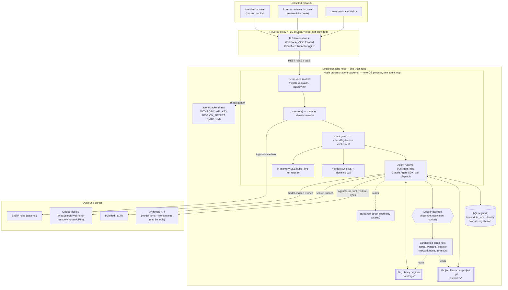

# Kuhn production threat model & data classification

> **Status:** Baseline — first production-pilot revision, 2026-08-16; revised
> 2026-08-17 after architecture review (PLA-224).
> **Scope:** the small-team, single-deployment production pilot defined in
> [ADR 002 — production deployment topology](../adr/002-production-deployment-topology.md).
> **Companion documents:** [architecture.md](../architecture.md) (what the system is),
> [data-pipeline.md](../data-pipeline.md) (operator's data inventory and egress),
> [deployment.md](../deployment.md) (how to run it). This document is the security
> counterpart: trust boundaries, principals, data classes, egress policy, threats,
> and the invariants future reviews enforce.

This is a threat model of the **actual Kuhn implementation**, not a generic
checklist. Every control claim is cited to code (`file:line`). Where a control is
missing, the threat is written against the owning Linear remediation issue rather
than inventing a new one.

## 0. Reading this document

Three states are distinguished throughout, because the roadmap is mid-flight:

- **On `main` today** — behaviour verifiable in the current tree. (Note: `main` at
  `4ed5edf` does not boot on its own; it imports `routes/knowledge.js` and
  `db/knowledge-catalog.js`, restored by [PR #70](https://github.com/soundtrip-health/kuhn/pull/70)/PLA-255.
  The deployable artifact is "`main` + the knowledge branch," and this model treats it as such.)
- **Pending in an open PR** — accepted direction not yet on `main`. Two are open:
  [#69](https://github.com/soundtrip-health/kuhn/pull/69) (provider-neutral runtime
  foundation, ADR 001 — lands at `docs/adr/001-provider-agnostic-runtime-foundation.md`
  when #69 merges) and
  [#70](https://github.com/soundtrip-health/kuhn/pull/70) (knowledge catalog).
- **Future decision / open issue** — owned by a Linear issue (PLA-235…PLA-248), not
  yet designed or not yet built.

The threat inventory (§5) maps each significant threat to its owning issue.

---

## 1. System trust boundaries

Kuhn is **self-hosted**: one Node process, one browser app, in-process SQLite, and
a data directory on the host. There is no Kuhn cloud. The single-process topology is
a deliberate pilot choice (ADR 002), but it means **almost every trust boundary is a
logical boundary inside one OS process**, not a network boundary — a property this
model returns to repeatedly.

### 1.1 Trust-boundary diagram — current implementation

This diagram shows the system **as implemented today**: one Node process, direct
Docker invocation, in-memory registries. The **target production-pilot topology**
(web + worker + sandbox service, DB-backed event/control seam) is a different,
deliberate picture — see the "Pilot topology (target state)" diagram in
[ADR 002](../adr/002-production-deployment-topology.md) and the target boundaries
in §1.3 below.

### 1.2 Boundary inventory

| # | Boundary | Kind | Where it is enforced | Notes |
|---|---|---|---|---|
| B1 | Browser/client ↔ backend | Network (HTTPS) | Reverse proxy + `session()` | The proxy is operator-provided; the app has no TLS of its own. |
| B2 | Authenticated **member** REST API | Trust (session cookie) | `session()` `session.js:116-134`, guards `routes/guards.js:26-64` | Fails closed outside dev (401/503). |
| B3 | External-reviewer **guest** API | Trust (review-link cookie) | `review-auth.js`, mounted **before** `session()` `index.js:44-49` | Confined to `/api/review/*`; no project/path parameter — scope comes from the link row. |
| B4 | Yjs collaboration WebSocket (doc-sync) | Trust (cookie at upgrade) | `collab-auth.js:229-278`; per-message read-only gate `yjs-websocket.js:618-626` | Authorized once at upgrade; 60 s sweep re-checks. |
| B5 | Yjs **signaling** WebSocket (y-webrtc) | Trust (member cookie) | `yjs-signaling.js:42-59` | **Live but no client uses it** — see T-23. Per-connection auth cache is never invalidated. |
| B6 | Agent orchestration / product layer | In-process | `runAgentTask` `runtime.js:78-133` | The `runAgentTask` boundary is the provider-neutral seam; everything above it is Kuhn policy. |
| B7 | Provider/model runtime adapter | In-process (SDK) | Claude Agent SDK `runtime.js:310-331` | `permissionMode: 'bypassPermissions'`; the DB tool allowlist is the only gate. ADR 001 (#69) plans a normalized `AgentRuntime` seam beneath this. |
| B8 | Model/provider network egress | Network | SDK → Anthropic API | Credentials from env; code never sees them (`data-pipeline.md:140`). |
| B9 | Kuhn-owned research/search APIs | Network | `agents/search.js`, `citations.js` | PubMed/arXiv, query text only. |
| B10 | Background job execution | In-process | Live-run registry `runs.js:22-42` (in-memory) | No separate worker; jobs share the web event loop. |
| B11 | SQLite persistence | In-process file | `db.js:14-21` (WAL, FK on) | Synchronous; every query blocks the event loop. |
| B12 | Project files | Filesystem | `storage.js` project-root containment `storage.js:80-114` | Symlinks omitted entirely; `.git` segment reserved. |
| B13 | Org knowledge-library files | Filesystem | `storage.js` org-root containment `storage.js:52-60` | Deduped by `(org, sha256)`. |
| B14 | Per-project git history | Filesystem (`<dir>/.git`) | `history.js:31-37` (`execFile`, no shell) | Inherits full `process.env` into the git child `history.js:33`. |
| B15 | Rendering / ingestion | In-process → sandbox | `render.js`, `ingest.js` → `sandbox.js` | All execution goes through the sandbox; never in-process Typst/Pandoc. |
| B16 | Sandbox execution | Container | `sandbox.js:23-36` | `--network none`, `:ro` project mount, cpu/mem/pids caps, 60 s kill. |
| B17 | Docker/container control plane | Host privilege | `spawn('docker', …)` `sandbox.js:56` | **The web process holds host-root-equivalent Docker access.** This is the sharpest topology boundary — see T-24, PLA-240. |
| B18 | SMTP | Network | `mailer.js:10-15` | Optional; unset → links printed to stdout. |
| B19 | Future OIDC / identity provider | Network | *Not built* — PLA-237 | Magic-link is the only real-auth mode today. |
| B20 | Reverse proxy / TLS boundary | Network | Operator-provided; `trust proxy` **trusts all hops** `index.js:38` | See T-27 (host-header injection). |
| B21 | Backups | Storage | *Not built* — PLA-242 | No backup/restore/retention exists. |
| B22 | Deployment / operator access | Host | `.env`, DB file, `git pull` upgrade | `.env` edit + restart ⇒ self-provisioned super-admin (T-05). |

**The load-bearing observation for the whole model:** B6–B17 are boundaries *inside a
single OS process and its host*. There is no network or privilege separation between
the request handler, the agent runtime, the SQLite file, the project files, and the
Docker socket. Compromise of the web process is compromise of everything the host can
reach, including host-root via Docker. The production topology (ADR 002) narrows the
worst of these — chiefly B17 — and replaces B10 with the cross-process seam below.

### 1.3 Target production-pilot boundaries (ADR 002)

Once ADR 002's worker/sandbox split is implemented (PLA-244/240/243), the boundary
inventory grows these rows. They are targets — reviews of the implementing PRs must
check them, and this table supersedes B10/B17's "in-process" characterization for the
target state:

| # | Boundary | Kind | Contract | Security relevance |
|---|---|---|---|---|
| TB-1 | **Web ↔ worker: durable event/control seam** | Cross-process via shared SQLite | Ordered append-only job/domain event rows (worker→web); persisted `ask_user` replies, cancellation, suspension flags (web→worker); optional local wakeup that correctness never depends on (ADR 002 §2.3) | This is job events, question/reply delivery, and Yjs/reviewer-room invalidation becoming **integrity/authorization-bearing state**: event rows drive what the web shows and closes, control rows drive what the worker executes. Replay must be idempotent; durable mutations execute exactly once in the originating process (ADR 002 §2.4). Audit/idempotency: PLA-243. |
| TB-2 | **Web/worker ↔ sandbox service** | Local RPC (Unix socket/loopback) | Narrow enumerated render/ingest request types; never arbitrary commands; web calls it synchronously for render/export, worker for ingestion | The web and worker processes hold **no Docker access**; only the sandbox service touches the daemon (closes T-25). PLA-240. |
| TB-3 | **Sandbox service ↔ Docker daemon** | Host privilege | The single Docker client; hardened flags, digest-pinned images, own concurrency cap | Replaces B17. A web/worker compromise can *request* enumerated jobs, not run containers. |
| TB-4 | **Worker ↔ model provider / research APIs** | Network egress | Provider/model calls move to the worker; egress policy per §4 | Egress concentration in one non-request-serving process; spend controls (PLA-238) live here. |
| TB-5 | **Web + worker ↔ shared SQLite + files** | Multi-process file access | WAL + `busy_timeout`; `storage.js` chokepoint in both processes; same service user | Two processes now trust the same durable stores; tenancy invariants must hold identically in both (PLA-243 matrix). |
| TB-6 | **Data backup destination** | Storage (off-host) | Encrypted online-backup DB destination + files/orgs under a write barrier (ADR 002 §8.1–8.5) | Contains Confidential data, **no secrets** (T-32). PLA-242. |
| TB-7 | **Secret escrow** | Separate security domain | `KUHN_SESSION_SECRET`, future master key; provider credentials preferably reissued (ADR 002 §8.3) | Never co-located with the data backup — ciphertext and key stay in different domains. |

---

## 2. Principals & privilege model

| Principal | How authenticated | Authority | Cited |
|---|---|---|---|
| **Unauthenticated visitor** | none | `/health`, static SPA, `POST /api/auth/request-link`, `POST /api/review/lookup`/`claim` (token-bearing) | `index.js:43-49` |
| **Member — viewer** | `kuhn_session` cookie | Read project/org content; render/export previews; list jobs/traces | matrix `tenancy-matrix.test.js:175-255` |
| **Member — editor** | same | All viewer + write/move/upload files, dispatch agents, answer agent questions, mint/revoke review links, upload to org library, promote to library | `routes/guards.js`, `routes/agent.js:47` |
| **Member — owner** | same | All editor + member/invitation/settings management, org-library delete, catalog selections, promotion approvals | `routes/org-admin.js:50+`, `knowledge.js:304-372` |
| **External reviewer (guest)** | `kuhn_review_session` cookie | One document, one link; mode `view`/`comment`/`edit`; confined to `/api/review/*` | `review-auth.js:44-51`, `routes/review.js` |
| **Super-admin (platform)** | member cookie **+** `is_superadmin` | Create/rename/suspend/unsuspend orgs. **No tenant-content access.** | `routes/guards.js:71-75`, `db/orgs.js:33-59` |
| **Agent role** | server-side, within a job | The tool set granted to its seeded role; project-scoped | `db/seed-data.js:96-116`, `runtime.js:266` |
| **Sub-agent** | dispatched by a parent agent | Inherits `projectId`/`userId`; **role is model-chosen** | `runtime.js:1147-1166` |
| **Background worker** | *n/a* — same process | Runs in the web event loop today | `runs.js:22-42` |
| **Provider credential identity** | env var, per process | One `ANTHROPIC_API_KEY` for the whole deployment | `data-pipeline.md:140` |
| **Deployment/operator** | host access | `.env`, DB file, filesystem, Docker | B22 |

### 2.1 The super-admin invariant (validated against code)

> **Platform authority (`users.is_superadmin`) grants no access to any tenant's
> content. It is lifecycle-only: create, rename, suspend, unsuspend organizations.**

This is not aspirational — it is enforced structurally and was verified by reading
every read site of the flag:

- `is_superadmin` is read in exactly **one guard**, `requireSuperadmin`
  (`routes/guards.js:71-75`), which gates only `POST /api/orgs`,
  `GET /api/admin/orgs`, `PATCH /api/admin/orgs/:id` (`routes/orgs.js:58-196`).
- The tenancy chokepoint `checkOrgAccess(userId, orgId, minRole)`
  (`db/orgs.js:33-59`) — the sole path to every project/file/document/transcript
  route — **never reads the flag**; the invariant is stated in-code at `db/orgs.js:5-7`.
- Consequently a super-admin who is a member of nothing gets a non-leaking **404 on
  every tenant route**, pinned by `tenancy-matrix.test.js:296-305` and `:380-395`
  (super-admin creates an org, `member===false`, then `GET …/library` → 404).
- `POST /api/orgs` with `userId: null` creates an org with **no membership**
  (`db/orgs.js:178-192`) — the creator deliberately gets no content access.

**Residual escalation path (by design, worth modelling):** a super-admin can create a
*new* org naming themselves owner, and `KUHN_SUPERADMIN_EMAILS` is synced from env at
every boot (`db/init.js:226`, `db/users.js:14-34`). Anyone who can edit `.env` and
restart the process can make themselves super-admin — but still cannot read an
*existing* tenant's content without an owner issuing them an invitation. This keeps the
content boundary intact even against a rogue operator, up to the point where the
operator simply reads the SQLite file directly (which host access always permits). See
T-05.

---

## 3. Data classification

Kuhn's product is confidentiality-sensitive by nature (unpublished manuscripts, grant
material, protocols, uploaded source documents, organizational knowledge). The scheme
below is deliberately **four sensitivity tiers**, not ten bureaucratic ones:

- **Secret** — credentials and session/link secrets. Disclosure is immediate compromise.
- **Confidential** — tenant content and derived text. The reason customers ask about
  isolation before uploading a protocol.
- **Internal** — identity, configuration, audit, operational telemetry.
- **Public/Shared** — the Kuhn-curated guidance catalog and other non-tenant data.

**Tenant scope** is the second axis and matters as much as tier: a class is
*tenant-scoped* (belongs to one org), *user-scoped*, *cross-tenant-shared* (the org
library within an org; the catalog across orgs), or *deployment-scoped*.

### 3.1 Classification table

Columns: **Tier** · **Scope** · **Persistence** · **Enc-at-rest expectation** ·
**Backup expectation** · **Retention/deletion** · **May appear in logs?** ·
**Model/provider egress** · **Research-provider egress** · **Export**.

| Data class | Tier | Scope | Persistence | Enc-at-rest | Backup | Retention/deletion | In logs? | Model egress | Research egress | Export |
|---|---|---|---|---|---|---|---|---|---|---|
| **Unpublished drafts / project files** | Confidential | Tenant/project | `data/files/<projectId>/` + per-project `.git` | **Required** (host-provided; PLA-242) | Required (files + `.git`) | Deleted with project, immediately; git history removed too | No | **Yes** — when a tool reads them (`read_file`, `search_files`) | No | Per-file Pandoc `.docx`/`.tex` |
| **Uploaded source documents** (project) | Confidential | Tenant/project | same, any type, ≤20 MB | Required | Required | With project/file | No | Yes (if read by a tool) | No | Same |
| **Organization knowledge (library originals)** | Confidential | Cross-tenant-shared *within org* | `data/orgs/<orgId>/library/` | Required | Required (not reconstructible from DB — only sha256+chunks persist) | Owner delete removes bytes+chunks immediately | No | Via `search_org_knowledge` results | No | Per-document content fetch |
| **Org document chunks / FTS text** | Confidential | Tenant (org) | `org_document_chunks`, `org_chunks_fts` (SQLite) | Required (DB-level) | Required | Replaced on re-ingest; removed with doc | No | Via search results injected into prompts | No | No |
| **Agent system prompts** | Internal | Deployment (seeded) | `agents` table | Standard | Required | Versioned via seed | Prompt text may; no secrets | Sent as system prompt every turn | No | No |
| **Agent conversations / transcripts** | Confidential | Tenant/project | `messages`, `conversations`, `jobs` — **full model I/O incl. tool-read file contents** `runtime.js:357-419` | **Required** | Required | **Kept indefinitely; no retention** `data-pipeline.md:61-65` | Should not (bodies) | Are the model turns | No | Via `/jobs/:id/trace` to any project viewer |
| **Tool inputs / results** | Confidential | Tenant/project | in `messages` (tool_use/tool_result bodies) | Required | Required | With conversation | Should not | Round-tripped through the model | Search tools send query text | Trace endpoint |
| **Comments / review feedback** | Confidential | Tenant/project | `comments` (bodies + quoted excerpt) | Required | Required | Until author/project deletes | No | If read by a tool | No | No |
| **Citations / bibliographic metadata** | Internal→Confidential | Tenant/project | `bib_references` (incl. PubMed abstracts) | Standard | Required | With project | Query text may | If read | **Query text + PMIDs to PubMed/arXiv** | `.bib` in workspace |
| **User identity / membership** | Internal | User / deployment | `users`, `memberships`, `organizations` — **email + display name only PII** | Standard | Required | User delete keeps content with attribution nulled (`ON DELETE SET NULL`) | Email appears in login-link logs | Reviewer display name server-stamped into Yjs awareness | No | No |
| **Auth tokens / session cookies** | **Secret** | User | `sessions`, `auth_tokens` — **sha256 hashes only**, never raw `db/auth.js` | **Required** | Required (but rotating `SESSION_SECRET` invalidates all) | Expired pruned opportunistically; **no revoke on role change** | **Raw token must never log** (does today if SMTP unset — T-08) | **Never** | Never | Never |
| **Invitation / review-link secrets** | **Secret** | Org / link | `invitations`, `review_links` — sha256 only | **Required** | Required | Single-use / TTL; revoke deletes sessions | **Invitation** raw token logs today when SMTP unset (T-08). **Review-link** raw tokens are *never* mailed or printed — returned once in the mint response only (`routes/review-links.js:56`); their exposure is the URL path/history/proxy logs (T-15) | Never | Never | Never |
| **Provider credentials** (`ANTHROPIC_API_KEY`, SMTP URL) | **Secret** | Deployment | `agent-backend/.env` only | **Required** (host) | **Required, isolated** | Manual | **Never** (code never sees them) | Never | Never | Never |
| **Provider/model configuration** | Internal | Deployment (today) / future org BYOK | `agents.model`, `config.js` | Standard | Required | Config | Non-secret | n/a | n/a | n/a |
| **Audit events** | Internal | Org/user | `auth_events` (`invite.*`, `org.*`, `knowledge.*`) | Standard | Required | Kept; **nothing reads them today** `db/auth-events.js:2` | Safe fields | No | No | No |
| **Logs / metrics / traces** | Internal (may embed Confidential) | Deployment | stdout/journald today | n/a | Operator | Operator | — | Must redact secrets & content | — | — |
| **Git history (per project)** | Confidential | Tenant/project | `<projectDir>/.git` | Required | **Required — inside the workspace, easily missed** | Removed with project | No | Contents are the files | No | No |
| **Backups** | Confidential + Secret (composite) | Deployment | *Not built* — PLA-242 | **Required + isolated** | — | Must define | Never | Never | Never | The DR artifact |

### 3.2 Notes that change how the classes are handled

- **Transcripts are the highest-volume Confidential store and the least protected.**
  Every model turn — including the *contents of any project file a tool read* — is
  persisted to `messages` (`runtime.js:357-364`, `:405-419`) and is retrievable by any
  **project viewer** through `GET /api/agent/jobs/:id/trace` (`routes/agent.js:86-95`).
  A viewer who never had file-write access can read, via a trace, file contents an
  agent surfaced. Kept indefinitely with no retention control. This is the single
  largest "more people can read it than you'd expect, forever" surface.
- **Org-library originals are not reconstructible from the database.** The DB holds
  sha256 + extracted chunks only (`schema.sql:290-315`). A backup that captures the DB
  but not `data/orgs/` loses the source documents. (PLA-242.)
- **Secrets are correctly hashed at rest in the DB** (`db/auth.js`) and correctly kept
  out of the container environment (`sandbox.js` passes **no** `-e`/`--env-file`;
  verified). The two secret-handling defects are *transport*, not storage: raw tokens
  login/invite tokens to stdout when SMTP is unset (T-08) and review tokens in the URL
  path (T-15). Review-link tokens never pass through the mailer/stdout fallback at
  all — the raw token appears only in the mint response (`routes/review-links.js:56`).

---

## 4. Provider egress policy

Provider agnosticism (ADR 001, in-flight via #69) must not become "anything can send
anything anywhere." This section states the **architectural expectation**; it does not
implement provider configuration (that is PLA-229/239/250).

### 4.1 Egress surfaces that exist today

Only four outbound paths exist (`data-pipeline.md:136-146`, verified):

1. **Anthropic API** — every agent turn. Sends the system prompt, the user message +
   editor context, prior turns, and **any project/org content the model reads with its
   tools**. One deployment-wide `ANTHROPIC_API_KEY`.
2. **Claude-hosted `WebSearch`/`WebFetch`** — for roles `ra`/`advisor` only
   (`seed-data.js:103`); fetches **model-chosen URLs** from Anthropic's side. This is a
   provider-specific capability, not a product invariant (ADR 001 §"Hosted web search";
   PLA-231 replaces it with Kuhn-owned research tools).
3. **PubMed / arXiv** — query text and identifiers only; no credentials.
4. **SMTP** — recipient email + login/invite URL, only if configured.

### 4.2 Expected policy per provider mode (future-facing, PLA-229/232/239/250)

| Provider mode | Credential source | Egress expectation | Cross-tenant separation |
|---|---|---|---|
| **Deployment-managed provider** (today: Anthropic) | Deployment env/secret store | All tenants' content may flow to it; the operator vouches for the provider's data policy | One credential, one destination; documented to owners |
| **Organization BYOK** (future) | Org-scoped secret, referenced by profile, never returned to browser | Only that org's content flows to that org's provider/credential | **Hard**: an org can never reference another org's credential/endpoint by id — PLA-239 |
| **Custom OpenAI-compatible endpoint** (future) | Org- or deployment-scoped, allowlisted | Only to explicitly configured base URLs; unsafe endpoint forms rejected before construction (spike already does this, ADR 001) | Endpoint is part of the allowlisted profile, not model-selectable |
| **Self-hosted / local model** (future) | Local, possibly no credential | Egress stays on-prem; still an explicit profile | Same |
| **Web search / fetch provider** | Provider or Kuhn-owned | Query + model-chosen URLs; must be a declared capability, off by default for confidential projects | Per-tenant policy |

### 4.3 Provider-side data-handling concerns operators must be able to see

The product must eventually expose to operators/owners (PLA-250):

- which provider/model each **role** routes to, and the **endpoint** it egresses to;
- whether that provider logs/trains/retains submitted data (a policy attribute of the
  profile, not something Kuhn can enforce — but it must be *surfaced*);
- **credential isolation**: profiles hold credential *references*, never secret
  material; secrets never enter prompts, model metadata, continuation state, logs, or
  DB-backed tool arguments (ADR 001 §"Credentials and egress");
- **cross-tenant separation**: no org may read, test, or route through another org's
  credential/endpoint by identifier (PLA-239, PLA-243).

The invariant, stated once: **provider egress is a property of an allowlisted,
tenant-scoped profile — never of model-selectable data.** A model may choose *what to
say*, never *where it goes* or *with whose credential*.

---

## 5. Threat inventory

Severity = qualitative (Critical/High/Medium/Low) for the **pilot** profile (small
trusted team, TLS front, dev-auth *not* used). Each row: asset · attacker &
prerequisite · impact · current control · evidence/test · residual risk · owning issue.

The dominant precondition across the highest-severity threats is **a
misconfiguration** (dev auth in production, missing `KUHN_APP_URL`, SMTP unset) or **a
web-process compromise** (which, given §1's single-zone topology, cascades). The pilot
is defensible primarily because the team is small and trusted and the front door is
TLS + magic-link; several controls that a hostile-multi-tenant SaaS would require are
tracked, not built.

### 5.1 Authentication, session, identity

| ID | Threat | Sev | Attacker / prereq | Impact | Current control | Evidence | Residual | Issue |
|---|---|---|---|---|---|---|---|---|
| **T-01** | **Production silently runs dev auth** — `KUHN_AUTH_MODE` defaults to `dev`; `x-kuhn-user` header becomes identity, auto-joined editor to default org; collab WS checks bypassed | **Critical** | Operator omits the var; any network client | Full-tenant compromise (read/write all content in the default org, writable Yjs on every room) | Docs warn (`deployment.md:52-53`); `assertAuthConfig` only fires *after* opting into non-dev | `session.js:116-123`, `collab-auth.js:124,207`, `config.js:41` | **Not fixed** — no runtime guard refuses dev mode on a non-loopback bind | **PLA-236** |
| **T-02** | **Non-Secure session cookie in production** — `secure` flag derived from `KUHN_APP_URL` (`http://localhost:5174` default), not the request | High | Operator forgets `KUHN_APP_URL`; network attacker | Session cookie sent over cleartext → theft | Docs note it; correct when `KUHN_APP_URL` is https | `routes/auth.js:29-31`, `config.js:60` | Config-dependent; boot validation would close it | **PLA-236** |
| **T-03** | **Session theft / no revocation on role change** — sessions never invalidated on demotion, member removal, or org suspension | High | Stolen cookie, or removed user | 30-day valid cookie; removed member keeps open SSE feeds and (≤60 s) Yjs writes | Per-request re-auth for *new* requests; 60 s Yjs sweep | `db/orgs.js:136-153`, `routes/orgs.js:170-175`, `yjs-websocket.js:325-340` | Open SSE feeds & running jobs **not** re-checked; no "log out everywhere" | **PLA-237**, PLA-244 |
| **T-04** | **Login-CSRF / session fixation** — `GET /api/auth/verify` is a state-changing GET that sets the cookie; no CSRF token | Medium | Trick victim into clicking attacker's verify link | Victim lands in attacker-chosen session | `SameSite=Lax` + single-use token limits it | `routes/auth.js:106-125` | Login-CSRF reachable; hardened session lifecycle owes a fix | **PLA-237** |
| **T-05** | **Operator self-promotes to super-admin** — `KUHN_SUPERADMIN_EMAILS` synced from env every boot | Medium | Host/`.env` write + restart | Attacker becomes platform admin; can create orgs, suspend others | By design; **still cannot read existing tenant content** (super-admin invariant) | `db/users.js:14-34`, `db/init.js:226`, `db/orgs.js:33-59` | Host access already implies DB read; audit of `.env` changes is external | PLA-236/243 (config validation, audit) |
| **T-06** | **Invitation abuse** — invite link is *also* an auth credential; intercept = session as invitee | Medium | Read the emailed link or the stdout log line | Account takeover of the invitee's new membership | Single-use, hashed, TTL, one-live-per-(org,email), suspension-aware | `db/invitations.js:35-118`, `mailer.js:41-44` | Link-in-transit and log exposure (see T-08); redeeming as existing member burns token without changing role | PLA-238 (rate/abuse), PLA-236 |

### 5.2 Authorization & tenancy

| ID | Threat | Sev | Attacker / prereq | Impact | Current control | Evidence | Residual | Issue |
|---|---|---|---|---|---|---|---|---|
| **T-07** | **Cross-tenant access / IDOR** — reference another org's project/doc by id | **High** (baseline risk) | Authenticated member | Read/write another tenant's content | **Strong**: single chokepoint `checkOrgAccess`; org derived from project row, not client input; non-leaking 404; last-owner invariant | `db/orgs.js:33-59`, `routes/guards.js:26-64`, matrix `tenancy-matrix.test.js:175-335` | **Well-controlled today**; the risk is *regression* as provider/worker surfaces are added | **PLA-243** (extend matrix + audit) |
| **T-08** | **Auth/invite secrets to stdout** — SMTP unset ⇒ live single-use login & invite links printed to server console (review-link tokens are *not* affected: they never pass through the mailer — minted and returned in-response only, `routes/review-links.js:56`; their URL-exposure risk is T-15) | **High** | Operator runs magic-link without `KUHN_SMTP_URL`; anyone who reads logs | Account takeover from log aggregation | Documented as intended dev behaviour | `mailer.js:19-22,41-44`, `deployment.md:130-137` | **Not fixed** — nothing ties SMTP-configured to auth mode | **PLA-236** (fail-closed), PLA-245 (log hygiene) |
| **T-09** | **Stale authorization on long-lived streams** — open SSE feed / running job authorized once | Medium | Member removed mid-stream | Continues receiving live project events / agent output until disconnect | Per-request re-auth covers new requests; Yjs swept | `routes/projects.js:316-343`, `routes/agent.js:47-55` | SSE & jobs not re-checked | PLA-244, PLA-237 |
| **T-10** | **Guest review-link abuse** — guest escapes the linked document | Medium | Holder of a review link | Reach other docs / projects | **Strong**: no path/project parameter; scope from link row; comment ops constrained to the linked doc; per-request DB re-validation; suspension-checked | `review-auth.js:44-51`, `routes/review.js:9-11,84-99`, `db/review-links.js:166-187` | Well-controlled; residual is link-in-URL exposure (T-15) and unthrottled claim (T-18) | PLA-238 |
| **T-11** | **Super-admin reads tenant content** | — (non-threat) | — | — | **Structurally impossible**: flag read only in `requireSuperadmin`; chokepoint ignores it | `routes/guards.js:71-75`, `tenancy-matrix.test.js:296-305,380-395` | Invariant holds; keep the matrix test green | PLA-243 |

### 5.3 Active content, browser origin, uploads

| ID | Threat | Sev | Attacker / prereq | Impact | Current control | Evidence | Residual | Issue |
|---|---|---|---|---|---|---|---|---|
| **T-12** | **Stored active-content (HTML/SVG) on the API origin** — `GET …/file` serves `.html` as `text/html` and `.svg` as `image/svg+xml`, no upload type allowlist, no `nosniff`, no CSP; single-port ⇒ API origin *is* app origin | **High** | Any editor or agent writes `evil.html`; a viewer opens it | Same-origin script execution against the (HttpOnly) session cookie: authenticated same-origin API actions as the viewer | HttpOnly blunts direct cookie theft, not same-origin actions | `routes/files.js:39-53`, `storage.js` (no type gate), no helmet | **Not fixed** | **PLA-235** |
| **T-13** | **Org-library uploader chooses response Content-Type** — `…/library/:docId/content` prefers client-supplied `doc.mime` over extension map | High | Org editor uploads `text/html` | Active content served to any org viewer | Same origin caveat as T-12 | `org-library.js:145` | **Not fixed** | **PLA-235** |
| **T-14** | **Malicious uploaded document → ingestion** — crafted PDF/docx processed by Pandoc/poppler | Medium | Editor uploads a malformed doc | Parser exploit *inside the sandbox* (network-isolated, `:ro`, capped) | Sandbox contains it; fail-soft ingestion | `ingest.js:41-67`, `sandbox.js:23-36` | Sandbox hardening gaps (T-24); `:latest` parser images (T-26) | PLA-240 |
| **T-15** | **Review-link token in URL path** — `/review/<token>`; no `Referrer-Policy` | Medium | Proxy/access logs, browser history, referrer | Token disclosure ⇒ guest session | Cosmetic URL rewrite post-claim; single-claim | `webapp/src/review/main.ts:530-531`, no helmet | **Not fixed** | PLA-235 (headers), PLA-238 |

### 5.4 Model / agent / tool threats

| ID | Threat | Sev | Attacker / prereq | Impact | Current control | Evidence | Residual | Issue |
|---|---|---|---|---|---|---|---|---|
| **T-16** | **Model-chosen sub-agent role (privilege selection)** — `dispatch_agent.agent_slug` is model-supplied free text; child resolves any seeded role's tool set; **compose-mode not inherited**, so a `/write` run can dispatch a sub-agent that writes files, bypassing the "no `file_change` during `/write`" contract | **High** | Prompt-injected or misbehaving model in any project | Within-project privilege widening; bypass of compose restriction | Bounded only by dispatch depth (≤2) and project scope | `runtime.js:1147-1173`, `:219-222`, `:1164` | **Not fixed** — role/compose inheritance needs constraining | PLA-226/227 (tool registry & runtime seam), PLA-243 |
| **T-17** | **Prompt injection via malicious content** — uploaded doc, org-library passage, or web-fetched page instructs the model to exfiltrate or misuse tools | High | Attacker-supplied content reaches a tool result | Data exfiltration to provider egress; unwanted writes (as suggestions under `draft/**`) | `projectId`/`orgId` **never model-supplied** (server-derived); storage containment; `draft/**` writes land as pending suggestions | `runtime.js:266,1013-1028`, storage `storage.js:80-114`, suggestion mode `:678-713` | Exfiltration through legitimate egress remains; needs egress policy + web-tool replacement | PLA-231, PLA-239 |
| **T-18** | **`bypassPermissions` + DB allowlist is the only tool gate** | High | Any prompt-injection foothold | Whatever the granted tool set allows | SDK `tools`/`allowedTools` filtering removes ungranted built-ins entirely (required because bypass makes `allowedTools` alone ineffective) | `runtime.js:34-42,271-275,320-322` | The allowlist is load-bearing; ADR 001 seam (#69) is where a stricter gate lands | PLA-226/227 |
| **T-19** | **Unvalidated `sessionId` passthrough to SDK `resume`** — client supplies `sessionId` on `POST /api/agent/task`, passed into SDK `resume` with no ownership check | Medium | Any project editor | Resume/replay a session not one's own; provider-side state confusion | None specific | `routes/agent.js:42,55` → `runtime.js:328` | **Not fixed** | PLA-227 (Kuhn-owned continuation), PLA-230 |
| **T-20** | **Excessive tool permissions / model-supplied identity** | Medium | Model | Broader capability than a task needs | `projectId`/`orgId` server-derived; file built-ins deliberately not granted; `.bib` write refused | `runtime.js:266,1208-1217` | Role granularity is coarse (any editor runs any role) | PLA-226 |

### 5.5 Resource, spend, availability, lifecycle

| ID | Threat | Sev | Attacker / prereq | Impact | Current control | Evidence | Residual | Issue |
|---|---|---|---|---|---|---|---|---|
| **T-21** | **Uncontrolled provider spend / no concurrency ceiling** — no per-user/org/global limit on concurrent runs or dispatches; per-run budget only | **High** | One authenticated editor | Open N SSE task streams; each tree burns ≤2.5 M weighted tokens; unbounded provider bill | Per-run token budget (2.5 M ×1.1) + 50-turn cap + depth ≤2 | `config.js:70-84`, no semaphore (grep-verified) | **Not fixed** — budget is per-dispatch-tree, in-memory, not per-tenant/day | **PLA-238** |
| **T-22** | **Resource exhaustion via sandbox fan-out** — render is **viewer**-triggerable; ingestion dispatches via bare `setImmediate`, no queue/limit | High | Any org viewer | N concurrent containers (N×512 MB + N CPUs); host memory/CPU/disk exhaustion (no `--ulimit fsize`) | Per-container caps + 60 s timeout | `routes/render.js:52`, `ingest.js:186-188`, `sandbox.js:23-36` | **Not fixed** — no concurrency cap or queue | **PLA-238**, PLA-240 |
| **T-23** | **Live-but-unused signaling endpoint** — `/yjs-signaling` mounted and reachable; no client uses it; per-connection auth cache **never invalidated** | Medium | Authenticated member | Generic room-scoped message relay; demoted/removed member keeps publishing for socket life | Member-only (guests refused); per-message topic auth (cached) | `yjs-signaling.js:42-59`, no client import (grep) | **Not fixed** — removable attack surface | PLA-243 (or remove) |
| **T-24** | **Sandbox escape → host** — container escape from Typst/Pandoc/poppler | **High** | Malicious document + a container 0-day | Reach the host; the web process runs as a Docker-privileged user | `--network none`, `:ro` project mount, cpu/mem/pids caps, 60 s kill, **zero credentials in env** | `sandbox.js:23-36`, verified no `-e` | **Hardening gaps**: no `--user`, `--read-only`, `--cap-drop=ALL`, `--security-opt=no-new-privileges`, `--tmpfs`, `--ulimit fsize` | **PLA-240** |
| **T-25** | **Web-process compromise ⇒ host-root via Docker** — the public Node process directly invokes the `docker` CLI; Docker socket access is host-root-equivalent | **Critical** | Any RCE foothold in the web process (e.g. via a dependency) | Full host compromise | None — Docker control is co-resident with request serving | `sandbox.js:56` | **Not fixed** — the central topology finding | **PLA-240** (isolate behind a narrow sandbox service; ADR 002 §6) |
| **T-26** | **Supply-chain / unpinned images** — `:latest` for Typst/Pandoc/poppler; no digest pinning | Medium | Upstream image compromise between pulls | Malicious parser runs on untrusted docs | Sandbox contains network; images process untrusted input | `config.js:152-155` | **Not fixed** | PLA-240 (pin), PLA-247/248 (build gates) |
| **T-27** | **Reverse-proxy / trusted-header mistake** — `trust proxy` trusts *all* hops; magic-link/invite/review URLs built from `req.protocol`+`Host` | High | Direct origin reach, or a proxy that forwards client `X-Forwarded-*` | **Host-header injection**: trigger `request-link` for a victim, emailed login link points at attacker host | Correct behind a proxy that sets the headers and blocks direct reach | `index.js:38`, `routes/auth.js:48`, `routes/orgs.js:109`, `routes/review-links.js:80` | **Not fixed** — production credential URLs must be minted from the canonical configured origin (`KUHN_APP_URL`), removing request Host from the path entirely; bounded `trust proxy` remains defense-in-depth for request metadata | **PLA-236**, ADR 002 §7 |
| **T-28** | **Stale/uncontrolled jobs after suspension/removal** — org suspension does **not** kill in-flight agent runs; parked `ask_user` runs live indefinitely with unbounded event buffers | High | Suspended tenant with a run in flight; or any run parked on a question | Suspended tenant keeps mutating files + spending budget until the run ends; memory growth from parked runs | Suspension stops *new* dispatch and `search_org_knowledge`; documented gap | `runtime.js:1029-1033`, `config.js:87-90`, `runtime.js:179-184` | **Not fixed** | **PLA-244** |
| **T-29** | **Provider outage / retry storm** — 5-attempt exponential backoff per turn; resume-on-retry can re-stream a half-completed turn | Medium | Provider degradation | Amplified load; duplicated partial output | Full-jitter backoff, cap 30 s; transient classification | `runtime.js:287-307,459-474` | No circuit breaker; no wall-clock run timeout | PLA-244/245 |

### 5.6 Persistence, durability, operations

| ID | Threat | Sev | Attacker / prereq | Impact | Current control | Evidence | Residual | Issue |
|---|---|---|---|---|---|---|---|---|
| **T-30** | **No backups / incomplete deletion / no export** — no backup, restore, retention, or at-rest encryption; deletes are immediate hard deletes | **High** | Disk failure, ransomware, fat-finger delete | Permanent data loss of manuscripts/grants; no DR; likely data-portability gap | Per-project git history (files only, on-host, deleted with project) | `data-pipeline.md:61-77`, `deployment.md:92-95` | **Not fixed** | **PLA-242** |
| **T-31** | **SQLite/file corruption or partial upgrade** — startup runs `DROP TABLE`-based rebuilds on live data; no version table; `initDb` failure **starts the server anyway** | **High** | Any restart after a schema change; crash mid-rebuild | Corrupt/half-migrated DB; a running-but-broken service a supervisor won't catch | Rebuilds are transactional + `foreign_key_check`; WAL | `db/init.js:82-183,211-227`, `index.js:116-119` | **Not fixed** — no migration ledger, no pre-migration backup, no fail-closed | **PLA-241**, PLA-236 |
| **T-32** | **Backup leakage** — future backups will contain Confidential + Secret data | High (future) | Backup store compromise | Whole-tenant disclosure incl. secrets | *Not built* | — | Design must isolate & encrypt backups; retain tenant isolation | **PLA-242** |
| **T-33** | **Operator mistakes during deploy/restore** — upgrade is `git pull && npm install && npm run build`; no reproducible artifact, no rollback, no graceful shutdown (no SIGTERM handler; pending git commits `unref`'d and lost) | High | Routine operations | Lost coalesced edits; phantom `running` jobs; inconsistent state | systemd `Restart=on-failure` | `deployment.md:184-193`, no shutdown handler (grep) | **Not fixed** | **PLA-248**, PLA-246, PLA-244 |
| **T-34** | **Backup consistency (WAL)** — 2.7 MB WAL against a 4 KB main DB locally; copying `kuhn.sqlite` alone backs up an essentially empty DB; no `busy_timeout` so external tools hit `SQLITE_BUSY` | Medium | Naive `cp` backup | Silent data loss on restore | WAL integrity survives crashes | `db.js:14-21` (no busy_timeout), `render`/backup notes | Design requires the SQLite online-backup method (`db.backup()`/`VACUUM INTO`) producing a standalone destination DB — ADR 002 §8.1 | **PLA-242** |
| **T-35** | **Malicious/compromised dependency** — RCE via npm supply chain; ADR 001 notes 6 known `npm audit` findings on `main` | Medium | Upstream compromise | Web-process RCE ⇒ §1 cascade incl. Docker host-root | None beyond version pinning | ADR 001 §"Package and version policy" | Remediation independent of provider work | PLA-247 (CI gates) |
| **T-36** | **Unauthenticated `/health` info leak** — echoes `db.error` to unauthenticated callers | Low | Anyone | Minor internal detail disclosure | Minimal payload otherwise | `routes/health.js:6-14` | Low | PLA-246 |

---

## 6. Security invariants

The list future code reviews (and PLA-243's expanded matrix) can enforce mechanically.
Each is grounded in the architecture this model recommends; the parenthetical marks
whether it **holds today** or is a **target** the owning issue must deliver.

1. **Server derives tenant/project identity.** Org/project id comes from the session
   and the resolved project row, never from client- or model-supplied parameters
   (`db/orgs.js:33-59`, `routes/guards.js:26-44`, `runtime.js:266,1013-1028`). *(Holds.)*
2. **One tenant cannot reference another tenant's credential, endpoint, or profile by
   identifier.** No org may read, test, or route through another org's provider secret.
   *(Target — PLA-239/243; the pattern already holds for content.)*
3. **Unauthenticated and guest surfaces cannot escape their explicit allowlists.**
   Guests are confined to `/api/review/*` with scope from the link row and no
   path/project parameter (`review-auth.js:44-51`, `index.js:44-49`). *(Holds.)*
4. **Production cannot silently fall back to dev auth.** A production profile must
   refuse to boot in `dev` mode, without a strong `SESSION_SECRET`, with a non-https
   `KUHN_APP_URL`, or with magic-link enabled and no SMTP. *(Target — PLA-236; today
   only a partial `assertAuthConfig` guard exists.)*
5. **Model/tool execution never widens storage containment.** All file access goes
   through `storage.js`; symlinks are never followed, `.git` is reserved, `draft/**`
   agent writes land as suggestions; sub-agent role/compose inheritance must not widen
   privilege (`storage.js:80-114`, `runtime.js:678-713`; T-16 is the open gap). *(Partly
   holds — PLA-226/227 for the sub-agent gap.)*
6. **Web-process compromise must not imply host-root-equivalent Docker control.**
   Sandbox invocation must sit behind a narrow, dedicated boundary, not a direct
   `docker` CLI call from the request-serving process (`sandbox.js:56` today). *(Target —
   PLA-240, ADR 002 §6.)*
7. **Provider credentials never enter prompts, browser responses, logs, model
   metadata, continuation state, or DB-backed tool arguments.** The code never sees
   `ANTHROPIC_API_KEY`; the sandbox environment carries no credentials. *(Holds for the
   Anthropic key; PLA-239 extends it to BYOK/redaction. T-08's raw-token logging is the
   live violation to close — PLA-236.)*
8. **Backups retain tenant isolation and encryption expectations — and never contain
   secrets.** The data backup captures a consistent SQLite **online-backup
   destination** database, `data/files/` including every `.git`, and `data/orgs/`,
   taken under a brief write barrier; it is encrypted, access-controlled, and restores
   under the recorded application/schema version. Secret material lives in a
   **separate escrow domain** — the ciphertext and its key never share a security
   domain — and `guidance-docs/` restores from the versioned application artifact,
   not from tenant data. *(Target — PLA-242; ADR 002 §8.)*
9. **Authorization is re-evaluated for the lifetime of a grant, not only at its start.**
   Long-lived streams (SSE), running jobs, and collaboration sockets must honour role
   removal and suspension within a bounded window; suspension must terminate in-flight
   work. *(Partly holds — Yjs 60 s sweep; SSE/jobs are the gap — PLA-244/237.)*
10. **Every security-sensitive change is attributable after the fact.** Auth/admin/
    knowledge actions write `auth_events`; a durable, *readable* audit trail must exist.
    *(Partly holds — events are written but nothing reads them — PLA-243.)*

---

## 7. Relationship to the roadmap

Every High/Critical threat maps to an existing Linear issue; **no new issue is required
by this model** — the milestone-3/4 security and reliability work already covers the
gaps this analysis found. The mapping:

| Owning issue | Threats it closes |
|---|---|
| **PLA-235** — block stored active content | T-12, T-13, T-15 |
| **PLA-236** — fail closed in production, validate config at boot | T-01, T-02, T-08, T-27, T-31 |
| **PLA-237** — production identity adapter + hardened sessions | T-03, T-04, T-06 |
| **PLA-238** — rate limits, quotas, abuse controls | T-21, T-22, T-06, T-18 (spend), T-15 |
| **PLA-239** — provider credential storage, scoping, rotation, redaction | T-17 (egress), invariants 2 & 7 |
| **PLA-240** — isolate/harden sandbox; remove Docker root-equivalent exposure | T-24, T-25, T-14, T-26 |
| **PLA-241** — versioned migrations + upgrade safety | T-31 |
| **PLA-242** — backups, restore, retention, deletion, export | T-30, T-32, T-34 |
| **PLA-243** — tenancy regression coverage + audit trail | T-07, T-09, T-11, T-16, T-23, invariants 1/2/10 |
| **PLA-244** — durable, leased, cancellable, suspension-aware jobs | T-28, T-09, T-29, T-33 |
| **PLA-245/246** — observability; readiness/health/shutdown | T-33, T-36, T-29, T-08 (log hygiene) |
| **PLA-247/248** — CI gates; reproducible artifacts/rollback | T-33, T-35, T-26 |
| **PLA-226/227** — Kuhn tool registry + `AgentRuntime` seam | T-16, T-18, T-19, T-20 |
| **PLA-231** — Kuhn-owned research tools (replace hosted WebSearch/WebFetch) | T-17 (web-fetch egress) |

**No material High/Critical threat was found that lacks an owning issue.** The one
finding worth flagging as *newly explicit* rather than new-in-kind is the **sub-agent
role/compose escalation (T-16)**: it is a concrete privilege-widening path that the
provider-runtime issues (PLA-226/227) touch structurally but do not currently name as a
security requirement. It is recorded here and reflected in the PLA-227 note (§ roadmap
reconciliation in the PR), not spun into a duplicate issue.

---

*Maintenance: revisit before any deployment that changes the topology in
[ADR 002](../adr/002-production-deployment-topology.md) (worker split, Postgres, object
storage, multi-instance), and whenever a provider mode beyond deployment-managed
Anthropic is enabled. The classification table (§3) and egress policy (§4) are the parts
most likely to drift as provider work (PLA-229–239) lands.*
